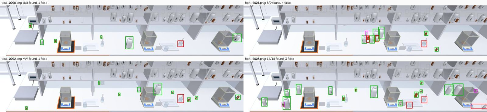

# Fixed-camera bottle detection: benchmark

Which detector finds the sample bottles on the bench from the fixed room camera,
measured on simulator renders with exact truth. Two detectors that need no
training are the references (YOLO-World L with bottle prompts, YOLO26s on
COCO); two detectors to fine-tune on simulator-labelled frames were chosen
(YOLO26n and RF-DETR), and the laptop's CPU allowed one epoch of the first.
Everything here was run on 19 September 2026 on the team laptop (Intel
i5-12450H, 8 cores, 16 GB, no GPU).

## Results

**In one line:** a YOLO26n fine-tuned for a single epoch on the CPU, on
simulator-labelled crops, finds bottles on the bench as well as the best
detector that needs no training (YOLO-World L), finds more of the smallest
ones, tells amber from HDPE, costs a fraction of the compute, and is the
most robust to a degraded camera. On a scene it never saw, YOLO-World L holds
up slightly better.

### Main test

Gantry scene, nominal light and camera. The same 30 `test` frames and 334
bottles to find for the three models; worktop region, worktop filter, each
model at the threshold it chose on `val`.

| model | training | AP50 [95 % CI] | AP50:95 | recall [95 % CI] | precision | false boxes / frame | kit AP50 |
| --- | --- | --- | --- | --- | --- | --- | --- |
| YOLO26n fine-tuned | 1 epoch, CPU | 0.864 [0.83-0.89] | 0.639 | **0.886** [0.84-0.92] | 0.836 | 1.93 | **0.88** |
| YOLO-World v2 L, bottle prompts | none | **0.871** [0.84-0.89] | **0.669** | 0.847 [0.81-0.88] | 0.797 | 2.40 | 0.41 |
| YOLO26s COCO | none | 0.687 [0.64-0.73] | 0.548 | 0.722 [0.68-0.76] | **0.873** | **1.17** | - |

The fine-tuned model and YOLO-World L are level on AP50 (the intervals
overlap almost entirely). The fine-tuned one finds more bottles at a higher
precision; YOLO-World draws tighter boxes (AP50:95). On all 60 frames the
fine-tuned model scores 0.835 AP50 [0.81-0.86] and YOLO26s COCO 0.690.

**Kit AP50** asks whether each box also names the right kit. The fine-tuned
model was trained on `amber_bottle` / `hdpe_bottle`; YOLO-World only gets
there through prompts such as "small brown bottle", and mostly does not.

**Cost.** At full CPU speed and on the full frame, YOLO-World L took 6.1 s per
frame and YOLO26s 1.2 s (screening table below). YOLO26n has a quarter of
YOLO26s's operations (5.4 against 20.7 GFLOPs at 640 px). Latencies measured
later in the night are not comparable across models: the CPU was held at a
fifth of its speed and shared with other jobs whose load changed by the hour.

#### Recall by bottle (same 30 frames)

| bottle | YOLO26n fine-tuned | YOLO-World L | YOLO26s COCO | bottles |
| --- | --- | --- | --- | --- |
| amber 10 ml | **76 %** | 62 % | 30 % | 37 |
| amber 20 ml | **84 %** | 77 % | 60 % | 43 |
| amber 30 ml | **93 %** | 86 % | 79 % | 28 |
| amber 50 ml | **86 %** | 81 % | 73 % | 37 |
| amber 100 ml | 93 % | **96 %** | 89 % | 27 |
| HDPE 100 ml | 85 % | **90 %** | 60 % | 40 |
| HDPE 250 ml | **94 %** | 87 % | 74 % | 31 |
| HDPE 500 ml | **95 %** | 87 % | 89 % | 38 |
| HDPE 1 L | 100 % | 100 % | 100 % | 25 |
| HDPE 2 L | 89 % | **93 %** | 89 % | 28 |

#### Recall by apparent size (side of the full silhouette in the frame)

| side | YOLO26n fine-tuned | YOLO-World L | YOLO26s COCO | bottles |
| --- | --- | --- | --- | --- |
| under 16 px | **81 %** | 74 % | 52 % | 77 |
| 16-24 px | **86 %** | 84 % | 69 % | 102 |
| 24-32 px | **95 %** | 92 % | 78 % | 60 |
| 32-48 px | **94 %** | 86 % | 86 % | 50 |
| 48 px and over | 93 % | 93 % | 91 % | 45 |

The gap is where the problem is: under 24 px of side, which is the whole
amber kit up to 50 ml. The 10 ml amber bottle (8 x 15 px) is still missed one
time in four by the best model: that is a camera limit, not a model one (see
*What to do next*).

### Other scene and shifted camera

`test_open` is the open-desk scene, never seen in training; `test_shift` is
the gantry scene under strong light changes with the frame degraded like a
real camera. The table compares the three models on the same first 30
frames of each split.

| split | model | frames | AP50 [95 % CI] | AP50:95 | recall [95 % CI] | precision | false boxes / frame |
| --- | --- | --- | --- | --- | --- | --- | --- |
| `test` | YOLO26n fine-tuned | 30 | 0.864 [0.83-0.89] | 0.639 | 0.886 [0.84-0.92] | 0.836 | 1.93 |
| `test` | YOLO-World L | 30 | 0.871 [0.84-0.89] | 0.669 | 0.847 [0.81-0.88] | 0.797 | 2.40 |
| `test` | YOLO26s COCO | 30 | 0.687 [0.64-0.73] | 0.548 | 0.722 [0.68-0.76] | 0.873 | 1.17 |
| `test_open` | YOLO26n fine-tuned | 30 | 0.675 [0.64-0.71] | 0.500 | 0.870 [0.83-0.91] | 0.662 | 6.83 |
| `test_open` | YOLO-World L | 30 | 0.715 [0.67-0.76] | 0.553 | 0.857 [0.82-0.89] | 0.560 | 10.33 |
| `test_open` | YOLO26s COCO | 30 | 0.500 [0.45-0.55] | 0.422 | 0.770 [0.72-0.82] | 0.486 | 12.50 |
| `test_shift` | YOLO26n fine-tuned | 30 | 0.767 [0.73-0.81] | 0.566 | 0.810 [0.75-0.86] | 0.840 | 1.57 |
| `test_shift` | YOLO-World L | 30 | 0.685 [0.58-0.76] | 0.488 | 0.675 [0.57-0.76] | 0.786 | 1.87 |
| `test_shift` | YOLO26s COCO | 30 | 0.260 [0.17-0.35] | 0.195 | 0.295 [0.19-0.40] | 0.789 | 0.80 |

On all 60 frames the fine-tuned model scores 0.674 AP50 on `test_open` and
0.776 on `test_shift`.

- **Other scene.** All three lose precision, not recall: the open desk puts
  props in view that the gantry scene's camera never showed (the drying rack,
  the sink, more glassware), and they draw false boxes. Here the model with no
  training of ours holds up best: YOLO-World L keeps 0.715 AP50 against the
  fine-tuned model's 0.675, though with more false boxes (10.3 per frame
  against 6.8). Fine-tuning on one scene bought accuracy on that scene, not on
  others; the robot's own scene has to be in the training data.
- **Shifted camera.** Blur, noise and JPEG erase what little an 8 px bottle
  offers. The COCO model collapses (recall 0.72 to 0.30), YOLO-World L drops
  from 0.85 to 0.68, and the fine-tuned model from 0.89 to 0.81, the smallest
  loss of the three. It was trained with light and camera-pose randomisation
  but no blur or noise, so this is the randomisation paying off, and
  degradation augmentation (`fixedcam_crops.py --degrade`) is the obvious next
  step.

### What the examples show

`scripts/fixedcam_examples.py` draws the cached boxes on the worktop band
(green found, magenta missed, red false, grey not required). On the test
frames the most frequent false box is one static object, the glass weighing scoop
beside the right-hand balance, the same one in every frame, plus boxes merging
two touching bottles. Both are the kind of error that hard negatives fix:
render the bench with no bottles and train on it.



*YOLO26n fine-tuned, first four `test` frames, worktop band only: 37 of 40
bottles found, 9 false boxes, four of them on the scoop.*

### What to do next

1. **Train the fine-tuned model properly, on a GPU.** One epoch on a throttled
   laptop already matches YOLO-World L. 20 to 50 epochs of YOLO26n (or s), with
   bottle-free bench frames as hard negatives and `--degrade 0.5` crops, should
   clear it. The commands above run unchanged on RunPod or Colab.
2. **Train RF-DETR there too** (commands above): the second fine-tuned model
   the plan asked for, and the bet for the change of renderer.
3. **Train on the scene the robot will see.** `test_open` shows a scene change
   costs precision. When the Isaac scene exists, convert its Replicator output
   (`isaac_replicator_to_gt.py`), score it here first with the models as they
   are, then add its frames to training.
4. **Give the 10 ml bottle more pixels.** At 8 x 15 px it is missed one time in
   four by the best model. 4K, the Narrow lens or a mount closer to the working
   area doubles its size; `labvision.detector.apparent_size_px` checks a mount
   before rendering.
5. **Score the full splits** when a normal CPU or a GPU is at hand
   (150 / 100 / 100 frames instead of 30 to 60): the caches resume where they
   stopped.


## The camera and why it is hard

The fixed camera is the scene's `general` GoPro: Linear lens, 1920 x 1080,
60.44 degree vertical field of view, on the aisle wall at (-1.5, -2.9, 3.0),
pitched 39 degrees down. It sees the bench from 3 to 4 m away.

| bottle | size in the frame (median, w x h) | side (sqrt(w h)) |
| --- | --- | --- |
| amber 10 ml | 8 x 15 px | 11 px |
| amber 50 ml | 15 x 25 px | 20 px |
| amber 100 ml | 18 x 31 px | 24 px |
| HDPE 100 ml | 16 x 28 px | 22 px |
| HDPE 500 ml | 26 x 46 px | 35 px |
| HDPE 2 L | 40 x 71 px | 55 px |

Three things make it hard:

1. **Size.** Half the kit is under 24 px of side, the size below which
   pretrained detectors lost vessels in the first benchmark (`BENCHMARK.md`).
   Resizing the frame to a network's usual 640 px input would leave the 10 ml
   bottle at 3 x 5 px, so every model here runs at the frame's own resolution
   or on enlarged tiles.
2. **Look-alikes.** In `minihannover_scene.xml` the gantry above the bench holds
   187 more sample bottles with the same glass, caps and labels. They are real
   bottles, so no prompt or class can reject them. Only geometry can.
3. **White on white.** HDPE bottles are white on a white, glossy worktop.

## What is measured

### Frames

`scripts/fixedcam_dataset.py` renders the `general` camera with MuJoCo and
writes the exact visible box and full silhouette of every sample bottle from
segmentation passes (`render_perfumery.Lab`). Scenes are loaded as committed and
changed only in memory: up to 37 movable bottles (the scene's 7 loose ones plus
3 of every size of both kits) are laid out on free worktop by ray casts, spread
out or in clusters that hide each other.

| split | scene | frames | what changes | used for |
| --- | --- | --- | --- | --- |
| `train` | gantry | 600 | layout, light intensity and colour, worktop tint, camera moved by ~7 cm and ~2 deg | fine-tuning |
| `val` | gantry | 60 | same as train, other seeds | model selection, the operating threshold |
| `test` | gantry | 150 | layout only; nominal light and camera | **the main benchmark** |
| `test_open` | open desk | 100 | layout; a different scene (no gantry, wider desk) never seen in training | generalisation |
| `test_shift` | gantry | 100 | layout, strong light changes, and the frame degraded like a real camera (blur, noise, JPEG, gamma) | robustness, a proxy for Isaac and for a real GoPro |

Every split uses its own seeds, so no layout appears in two splits.

### Scoring

`labvision/evaluation.py`, with tests in `tests/test_evaluation.py`, scores every
model the same way:

- **Must be found:** a sample bottle standing on the bench, at least half
  visible, not cut by the frame border.
- **Ignored:** every other sample bottle in view (on a shelf, mostly hidden,
  clipped). A box on one is neither a hit nor a false positive, like COCO's crowd
  regions.
- **Match:** greedy by score, IoU at least 0.5 with the visible box.
- **AP50** and **AP50:95**: COCO's 101-point interpolated average precision,
  class-agnostic. The detector's job is "there is a bottle here".
- **Operating point:** one score threshold per model, the best F1 on `val`,
  applied unchanged to every test split. Recall, precision and false boxes per
  frame are counted there.
- **Intervals:** 95 % bootstrap over whole frames (1000 resamples).
- **Latency:** median wall time per frame on this CPU, model only.

### The worktop filter

The camera never moves and its pose is known by calibration, so a box can be
checked against the bench without any object pose: cast the bottom centre of
the box onto the worktop plane (z = 0.90 m); keep it if it lands on the worktop
outline and if its pixel height fits a bottle 4.5 to 26 cm tall standing
there. A shelf bottle's base casts far behind the bench, where a bottle of its
pixel height would have to be metres tall. All numbers below are with the
filter; the raw numbers are in `results/fixedcam/*/metrics.json`.

An independent check of the filter on every split kept 100 % of the bottles
that have to be found, so it costs no recall by construction.

### The worktop region

For the same reason every model in the final tables runs on the worktop's band
of the frame only (`+roi` in the model names): the corners of the bench
outline, at the worktop and 26 cm above it, are projected with the camera's
pose, and the frame is cropped to the box they span, at native resolution.
That is half the pixels of the full frame, so it halves the CPU time, and it
is how the detector would run on the robot. The screening table further down
was run on the full frame, before this protocol was fixed.

## Choosing the models

A literature and tooling check (sources at the end) and a screening run on 30
validation frames picked the four.

### Without training

| model | prompts | why considered | outcome |
| --- | --- | --- | --- |
| YOLO-World v2 L | bottle names | the team's current choice | kept |
| YOLO-World v2 L | `labvision.detector.PROMPTS` (everyday vessels) | the current default | prompts cost ~0.3 AP50 here |
| YOLOE-26 L | bottle names | successor of YOLO-World, LVIS 37.8 zero-shot | close second, slower |
| YOLOE-11 L | bottle names | previous YOLOE | below YOLOE-26 |
| YOLOE-26 L | visual prompts from one val frame | "show it an example" | poor: an 8 x 15 px example carries little |
| YOLO11s COCO | classes bottle, cup, vase... | the team's fast choice | poor on these renders |
| YOLO26s COCO | same classes | new COCO model, small-object work in its loss | kept |
| YOLO26l COCO | same classes | larger | not scored: stopped to free the CPU |

Screening numbers: first 30 `val` frames, full frame, worktop filter on,
each model at its own best-F1 threshold on those frames (so these are a
little optimistic; the final tables below take the threshold from `val` and
score other frames). Latency is the median per 1080p frame on this CPU before
it was throttled, and was inflated for the models that ran while other jobs
shared the machine (marked *).

| model | AP50 | AP50:95 | recall | precision | false boxes / frame | s / frame |
| --- | --- | --- | --- | --- | --- | --- |
| YOLO-World v2 L, bottle prompts | **0.853** | 0.642 | 0.770 | 0.892 | 0.80 | 6.1 |
| YOLOE-26 L, bottle prompts | 0.839 | 0.607 | 0.685 | **0.926** | **0.47** | 6.6 |
| YOLO26s COCO | 0.812 | **0.646** | **0.848** | 0.762 | 2.27 | 1.2 |
| YOLOE-11 L, bottle prompts | 0.803 | 0.643 | 0.809 | 0.849 | 1.23 | 8.7* |
| YOLO-World v2 L, everyday prompts (`detector.PROMPTS`) | 0.576 | 0.440 | 0.778 | 0.656 | 3.50 | 12.7* |
| YOLOE-26 L, visual prompts | 0.524 | 0.343 | 0.541 | 0.777 | 1.33 | 10.4* |
| YOLO11s COCO | 0.370 | 0.296 | 0.420 | 0.812 | 0.83 | **1.1** |

What the screening says:

- **Name the samples, not vessels.** The same YOLO-World L goes from 0.58 to
  0.85 AP50 when the prompts describe amber and white plastic bottles instead
  of cups, glasses and beakers, which confirms the prompt experiment on the
  close camera (`world_prompts.py`).
- **YOLO26 is a real step over YOLO11 on tiny objects.** With the same COCO
  classes and no prompts, YOLO26s finds twice the bottles YOLO11s does (0.85 vs
  0.42 recall) at the same cost, which is what its small-target label
  assignment is for. It replaces YOLO11s as the fast reference.
- **YOLOE-26 L** ties YOLO-World L on AP50 with the best precision, but is no
  faster; YOLO-World stays the reference because the team already uses it.
- **Visual prompts do not work at this range**: one example box of 8 x 15 px
  gives the model almost nothing to match.

Not run: SAM 3 (the strongest open-vocabulary model, 53.6 LVIS box AP, but its
weights need manual approval on Hugging Face and it is 848 M parameters, 10 to
30 s per frame on this CPU); LLMDet and MM-Grounding-DINO (strong on LVIS,
seconds per frame on CPU, resize the frame to 800 px, which halves the bottles);
DINO-X and Grounding DINO 1.5/1.6 (cloud API only).

### A model fine-tuned on real lab equipment, tried and rejected

"Chemistry Lab Object Detection" (Roboflow Universe, `chemex/chemistry-lab-object-detection`,
YOLOv12n, 26 real chemistry-apparatus classes including `Reagent_Bottle`,
`Wash_Bottle`, `Weighing_Bottle` and `Nessler_Reagent_Bottle`, self-reported
0.99 mAP50) looked promising: a detector trained on lab bottles specifically,
not everyday vessels or COCO. It ships no downloadable weights, only a hosted
inference API (`labvision`'s benchmark now has `fixedcam_models.RoboflowPredictor`
for this, model key `chemex-bottles`, needs `ROBOFLOW_API_KEY`).

Scored the same way as the other three, worktop filter, `+roi`:

| split | model | frames | AP50 | recall | false/frame |
| --- | --- | --- | --- | --- | --- |
| `test` | chemex-bottles+roi | 30 | 0.000 | 0.000 | 0.00 |

Zero boxes on all 55 `val` and `test` frames scored, at every confidence down
to 0. That is not the whole story, though, and a first pass at explaining it
here (only a real photo of a crowded shelf, misclassified everything) was
wrong to call it pure overfitting: the model does generalise, unevenly, to
real photos it never trained on:

- Three unrelated Wikimedia photos of a plain Erlenmeyer flask (nothing to do
  with Chemex's dataset) are all found as `Conical_Flask` at 0.80-0.90
  confidence. A conical flask has one universal silhouette, and the model has
  genuinely learned it, not memorised its own backgrounds.
- Real photos of an actual reagent bottle are much shakier: one is named
  `Reagent_Bottle` correctly but at only 0.30, another is called `Beaker` at
  0.74. Bottles vary far more in real-world shape than a flask does, and it
  shows: the class we need is the model's weak one even on real photographs.
- Our own bottles, cropped tight and upscaled 2.5x (a fair, generous size, well
  above the reliable floor for other models here), do carry a trace of the
  right answer: `Reagent_Bottle` at 0.01-0.04. That is a further ten-fold drop
  from the already-weak 0.30 on a real bottle photo, which is what a genuine
  sim-to-real gap stacked on an already-weak class looks like — not nothing,
  not the strong signal a flask gets, low enough to disappear under any
  sane threshold.

So: a real, if partial, sim-to-real gap on top of a class the model was never
that confident about to begin with. **Lesson for reading any Universe model's
self-reported mAP: it says nothing about how the model does on your class in
particular, on images outside its own set** — test the exact class you need,
not the model's best one. No further tuning attempted; `chemex-bottles+roi`
stays in `fixedcam_bench.py` for anyone who wants to re-check a newer version.

### Fine-tuned

- **YOLO26** (Ultralytics, January 2026). NMS-free head, no DFL, and STAL, a
  label assignment that enlarges targets under 8 px when choosing anchors,
  which is aimed at exactly this problem. Fastest CPU inference of its family.
  AGPL-3.0, like the rest of Ultralytics.
- **RF-DETR** (Roboflow, ICLR 2026). A DETR with a DINOv2 backbone; the paper
  shows the backbone is what makes it fine-tune well from small datasets. It is
  the bet for the jump from MuJoCo to Isaac's renderer: a foundation backbone
  has seen far more appearance variation than a CNN trained on COCO.
  Apache-2.0. Risk: 16 px patches against 8 px bottles.

Both are trained on the same data: 384 x 384 crops cut from the `train` frames
at native resolution (`scripts/fixedcam_crops.py`), centred near bench bottles,
plus random crops of the worktop region. Every sample bottle in a crop is
labelled `amber_bottle` or `hdpe_bottle`, shelf bottles included: a shelf bottle
is a bottle, and the worktop filter tells bench from shelf.

### Training on this laptop

The laptop has no GPU, and from about 07:00 its CPU was held at a fifth of its
nominal speed (Windows' `% Processor Performance` counter read 20 % with the
machine otherwise idle), so training was cut to what fits:

- **YOLO26n**, COCO weights, 384 px crops, batch 16, AdamW (Ultralytics'
  automatic choice), random scale limited to +-25 % so 8 px bottles do not
  shrink to nothing. **One epoch** was trained (11 min at full speed): the
  next ones ran at 4 min per iteration, about five hours per epoch, and were
  stopped. After that single epoch the model reached 0.92 mAP50 on the
  validation crops (shelf bottles included) and is what the tables call
  "YOLO26n fine-tuned". It is an early checkpoint, not a converged model.
- **RF-DETR Nano** could not be trained here. Unfrozen it took ~17 s per crop on
  three threads; with the DINOv2 encoder frozen (8.3 M of 30 M parameters
  trainable), ~5.6 s per crop while sharing the CPU, which is 40 min per epoch
  of 400 crops at full speed and three hours at a fifth of it. The script is
  ready and was checked end to end on 16 crops (one epoch, checkpoint written).

To train RF-DETR on a GPU (RunPod or Colab, under an hour):

```bash
pip install --no-deps rfdetr==1.10.1
pip install pydantic pyDeprecate supervision peft "pytorch_lightning>=2.6,<3" \
    "torchmetrics[detection]>=1.8.2,<1.9" "faster-coco-eval>=1.7.2" pycocotools scipy \
    torch-hungarian==0.1.0rc0
PYTHONUTF8=1 python runs/fixedcam/train_rfdetr.py \
    ../simulation/out/fixedcam/crops384/coco runs/fixedcam/rfdetr_nano \
    --size nano --epochs 20 --threads 8 --batch 8 --accum 2
python scripts/fixedcam_bench.py run \
    "rfdetr:runs/fixedcam/rfdetr_nano/checkpoint_best_total.pth:nano:384" \
    --splits val,test,test_open,test_shift
```

`rfdetr[train]` is not installed whole on purpose: it pulls `roboflow`, which
downgrades numpy and adds `opencv-python-headless` next to `opencv-python`.
On Windows, `PYTHONUTF8=1` is needed or `rich` fails printing the COCO table.
Drop `--freeze-encoder` on a GPU: the full model is the stronger one.

To train YOLO26n properly on the same GPU, instead of the one-epoch checkpoint
above: `runs/fixedcam/train_yolo26n_gpu.py` restarts from the COCO weights
with mosaic, RAM caching and a full worker pool (no CPU-throttle chunking).
[`../../propuesta_gpu.md`](../../propuesta_gpu.md) specs the hardware
(Ampere/Ada, >= 24 GB VRAM, driver 570/580); provision it per
[`../../simulation/runpod-render.md`](../../simulation/runpod-render.md) §1
using one of that proposal's recommended cards (`NVIDIA A40`, `NVIDIA L40S`,
`NVIDIA RTX A6000` or `NVIDIA GeForce RTX 4090`), then:

The script keeps the same relative layout as this repo (`../yolo26n.pt`,
`../simulation/out/...`), so mirror that under one remote directory:

```bash
ssh -i "$SSHK" -p "$PORT" -o StrictHostKeyChecking=accept-new root@"$IP" \
    'mkdir -p /root/repo/computer-vision/runs/fixedcam /root/repo/simulation/out/fixedcam'
scp -i "$SSHK" -P "$PORT" runs/fixedcam/train_yolo26n_gpu.py \
    root@"$IP":/root/repo/computer-vision/runs/fixedcam/
scp -i "$SSHK" -P "$PORT" ../yolo26n.pt root@"$IP":/root/repo/yolo26n.pt
scp -i "$SSHK" -P "$PORT" -r ../simulation/out/fixedcam/crops384 \
    root@"$IP":/root/repo/simulation/out/fixedcam/
ssh -i "$SSHK" -p "$PORT" -o ServerAliveInterval=30 root@"$IP" \
    'cd /root/repo/computer-vision && pip install -q ultralytics && python runs/fixedcam/train_yolo26n_gpu.py'
scp -i "$SSHK" -P "$PORT" -r \
    root@"$IP":/root/repo/computer-vision/runs/fixedcam/yolo26n_384_gpu ./runs/fixedcam/
```

Copy the resulting `weights/best.pt` to `runs/fixedcam/yolo26n_fixedcam.pt` and
rerun `fixedcam_bench.py run "ft:runs/fixedcam/yolo26n_fixedcam.pt+roi"` to
compare against the CPU checkpoint's 0.864 AP50 (`compare_test30.md`).


## Running it

From `computer-vision/`, with the repository's virtual environment:

```bash
# 1. Frames and truth (about 1.5 s per frame)
python scripts/fixedcam_dataset.py --splits train,val,test,test_open,test_shift

# 2. Training crops, YOLO and COCO layouts
python scripts/fixedcam_crops.py --size 384 --per-frame 2 --random-share 0.5 \
    --out ../simulation/out/fixedcam/crops384

# 3. Fine-tune YOLO26n on the crops (see runs/fixedcam/train_yolo26n.py), then
#    copy best.pt to runs/fixedcam/yolo26n_fixedcam.pt for labvision's `fixedcam`

# 4. Score models on the worktop region (+roi); boxes are cached and resumed,
#    val always first because it sets each model's threshold
python scripts/fixedcam_bench.py run world-l-bottles+roi --splits val,test,test_open,test_shift
python scripts/fixedcam_bench.py run "ft:runs/fixedcam/yolo26n_fixedcam.pt+roi" \
    --splits val,test,test_open,test_shift
python scripts/fixedcam_bench.py run coco-yolo26s+roi --splits val,test,test_open,test_shift

# 5. Tables: every scored model, or several models on exactly the same frames
python scripts/fixedcam_bench.py summary
python scripts/fixedcam_bench.py compare world-l-bottles+roi coco-yolo26s+roi \
    "ft:runs/fixedcam/yolo26n_fixedcam.pt+roi" --splits test --max 30

# 6. Examples and a local HTML page
python scripts/fixedcam_examples.py "ft:runs/fixedcam/yolo26n_fixedcam.pt+roi" --split test
python scripts/fixedcam_report.py "ft:runs/fixedcam/yolo26n_fixedcam.pt+roi=YOLO26n fine-tuned" \
    "world-l-bottles+roi=YOLO-World L" "coco-yolo26s+roi=YOLO26s COCO"
```

`--max N` scores the first N frames of each split, which is what the tables
above used (30 or 60) while the CPU was throttled.

### Isaac Sim frames

Render with Replicator's `BasicWriter` and `rgb`, `bounding_box_2d_tight`,
`bounding_box_2d_loose` and `camera_params` on, with the sample bottles' semantic
class set to their sample id (`SMP-0001`) or to `amber_<ml>ml` / `hdpe_<ml>ml`.
Then:

```bash
python scripts/isaac_replicator_to_gt.py /path/to/replicator_out --split isaac_test \
    --bench-centre -1.5 -0.4 --bench-half 3.0 1.0
python scripts/fixedcam_bench.py run world-l-bottles --splits val,isaac_test
```

The converter writes the same split folder the MuJoCo renders use, so the same
commands train on Isaac frames (`fixedcam_crops.py --train isaac_train`). It was
tested on synthetic files in the documented format, not yet on real Isaac output.

## Sources

- YOLOE and YOLOE-26: https://docs.ultralytics.com/models/yoloe
- YOLO26: https://docs.ultralytics.com/models/yolo26 and https://arxiv.org/html/2606.03748v1 (STAL)
- YOLO-World: https://github.com/AILab-CVC/YOLO-World
- RF-DETR: https://arxiv.org/abs/2511.09554 and https://github.com/roboflow/rf-detr
- SAM 3: https://github.com/facebookresearch/sam3
- MM-Grounding-DINO and LLMDet: https://huggingface.co/docs/transformers/model_doc/mm-grounding-dino
- SAHI (sliced inference): https://arxiv.org/abs/2202.06934
- Domain randomisation for synthetic training data: https://arxiv.org/abs/1710.10710, https://arxiv.org/abs/2506.07539
- Replicator annotators: https://docs.omniverse.nvidia.com/extensions/latest/ext_replicator/programmatic_visualization.html
