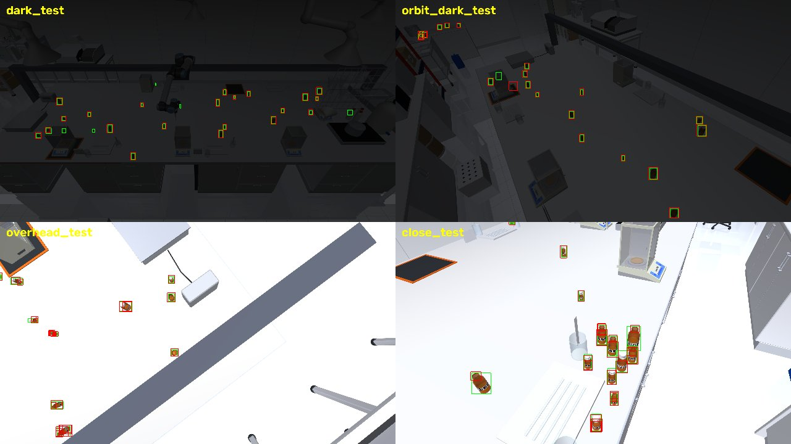
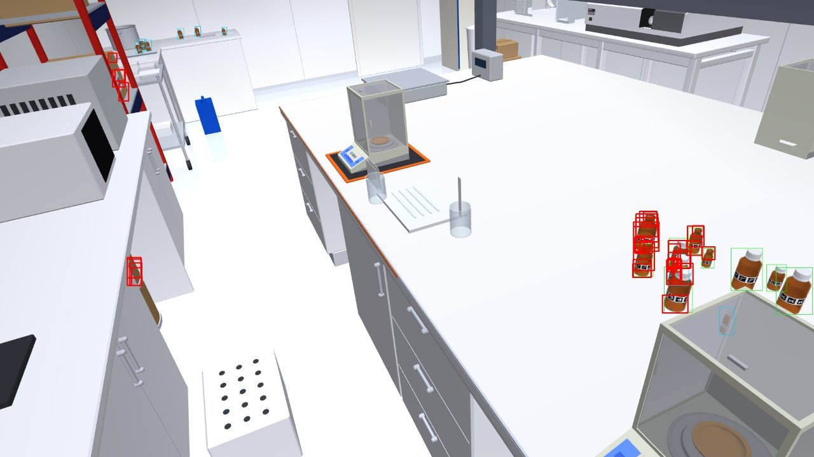

# A better YOLO26 in 100 ms: what to train, on what, and why

The detector in use is `rail`: YOLO26n fine-tuned on 1500 renders of the rail
scene from the wall-mounted `general` camera (`runs/rail`), run on whole
1920 px frames. The demo is real time, so the detector gets **100 ms a frame**,
and it has to hold up from other angles, close to the bottles, from above and
in a dim room. Training data is MuJoCo renders only.

> The scripts and splits named here (`viewpoint_study.py`, `limits_sweep.py`,
> `export_and_time.py`, `orbit_study_pod.sh`, `runs/orbit/`, the `orbit_*`,
> `close_*`, `dark_test` and `overhead_test` splits of `fixedcam_dataset.py`)
> are in a local worktree (branch `vision/orbit-dataset`) and not pushed
> yet: they share `fixedcam_dataset.py` with work still in progress. The
> measurements below stand on their own.

This measures what fits in 100 ms, measures where `rail` fails, and sets up the
runs that answer what to ship. **Everything in "Measured" was run here; the
training grid is ready but has not been run** — it needs a CUDA GPU and this
laptop has none.

## Measured: what fits in 100 ms

Whole `predict` calls, pre- and post-processing included, on this laptop's CPU
(i5-12450H, no GPU), one 1920 x 1080 frame, 16:9 input of the given width.
OpenVINO is an fp16 export with a fixed input shape
(`scripts/export_and_time.py`); 20 calls per cell, interleaved.

| model | input | PyTorch | OpenVINO median | OpenVINO p90 |
| --- | ---: | ---: | ---: | ---: |
| YOLO26n (2.6 M) | 1920 | 486 ms | 149 ms | 177 ms |
| **YOLO26n** | **1280** | 253 ms | **75 ms** | 91 ms |
| YOLO26n | 960 | 155 ms | 45 ms | 87 ms |
| YOLO26n | 640 | — | 27 ms | 48 ms |
| YOLO26s (10 M) | 1920 | 1921 ms | 363 ms | 452 ms |
| YOLO26s | 1280 | 656 ms | 170 ms | 209 ms |
| **YOLO26s** | **960** | 388 ms | **95 ms** | 116 ms |
| YOLO26s | 640 | — | 52 ms | 63 ms |

- The runtime matters more than the model: OpenVINO is 3 to 4 times faster
  than PyTorch on this CPU, with the same boxes. `rail` exported at 1280 scores
  recall 0.975 and AP50 0.977 on `rail_test`, exactly its PyTorch figures at
  that size, at a median of 45 to 52 ms over 30 to 60 rendered frames on an
  otherwise idle machine.
- A fixed input shape is required. A dynamic-shape export recompiles and ran
  up to 10 times slower in the same test.
- Under 100 ms on a CPU there are two candidates: **n at 1280** (75 ms, with
  headroom) and **s at 960** (95 ms, with none). `s` at 1280 and anything at
  1920 are for a GPU laptop only; `m` and `l` are out.
- The PyTorch column was taken with another job on the machine; read it as a
  ratio. int8 quantisation would roughly halve the OpenVINO column again and
  has not been tried: it needs calibration frames and a recall check.

What input size costs in accuracy, `rail` as it is, not retrained for the
smaller sizes:

| input | `rail_test` recall | bottles 12 to 20 px | false / frame | `orbit_test` recall | bottles 64 px + |
| ---: | ---: | ---: | ---: | ---: | ---: |
| 1920 | 0.993 | 0.980 | 1.5 | 0.970 | 0.88 |
| 1280 | 0.975 | 0.941 | 2.5 | 0.957 | 1.00 |
| 960 | 0.924 | 0.838 | 4.9 | 0.927 | 1.00 |

From the wall mount a bottle is 9 to 36 px tall at 1920. At 960 the far half
of the bench is 5 to 10 px and a third of it is lost; at 1280 little is, and a
model trained at 1280 should win part of that back. So the far bottles set the
input size, and **n at 1280 is the expected winner**: `s` at 960 buys capacity
with exactly the pixels the far bottles need.

## Measured: where the current model fails

Frozen test sets, seeds no training frame shares, scored at 1920 px with
`scripts/viewpoint_study.py rail` at the backend's threshold, 0.10, IoU 0.5.
These are 40 to 80 frames each; the pod renders the full 150 to 300.

| test set | what it shows | bottles | recall | false / frame | AP50 |
| --- | --- | ---: | ---: | ---: | ---: |
| `rail_test` | the wall mount, as trained | 1221 | 0.993 | 1.5 | 0.990 |
| `orbit_test` | any bearing, 1 to 3.5 m, 30 to 85 degrees up | 794 | 0.970 | 5.0 | 0.964 |
| `overhead_test` | the same from 70 to 88 degrees | 314 | 0.962 | 7.3 | 0.926 |
| `close_test` | any bearing, 0.35 to 1 m | 137 | 0.635 | 4.3 | 0.543 |
| `dark_test` | the wall mount, lights at 8 to 50 % | 721 | 0.935 | 0.6 | 0.948 |
| `orbit_dark_test` | any bearing, lights at 8 to 50 % | 387 | 0.938 | 3.2 | 0.942 |

**1. Near bottles: the size in the picture, not the angle.** `rail` never saw a
bottle over 36 px. Over `orbit_test` and `close_test`:

| bottle height | bottles | recall | fragment boxes per bottle |
| --- | ---: | ---: | ---: |
| under 32 px | 365 | 0.98 | 0.1 |
| 32 to 64 px | 407 | 0.97 | 0.3 |
| 64 to 96 px | 102 | 0.91 | 1.8 |
| 96 to 160 px | 49 | 0.22 | 1.4 |
| over 160 px | 8 | 0.00 | 0.0 |

A large bottle is missed, or broken into cap, label and body each boxed as a
small bottle (a fragment is a false box at least 70 % inside a bottle): 266 of
the 396 false boxes on `orbit_test` are fragments. By bearing and elevation
recall stays at 0.97 to 1.00.

**2. From above: found, but with false boxes.** Recall holds at 0.96 looking
straight down; false boxes rise to 7.3 a frame, and 206 of the 291 are
fragments again: from above a bottle is a cap inside a shoulder, and each gets
a box.

**3. Things the wall mount never shows up close.** The other 130 false boxes on
`orbit_test` (1.6 a frame) are brown cardboard boxes, the drums under the
bench and the shelf rack.

**4. Dark: fine down to a fifth of the light, then not.**

| light left | `dark_test` recall | `orbit_dark_test` recall |
| --- | ---: | ---: |
| 35 to 50 % | 1.000 | 0.964 |
| 20 to 35 % | 0.983 | 0.983 |
| 8 to 20 % | 0.753 | 0.778 |

`rail_train` never goes under 55 % of the scene's light.

**5. Thresholds move.** The best-F1 threshold on `orbit_test` is 0.62, not the
0.10 found on the wall mount; it has to be taken again on validation frames of
every view, which the grid does.

### How far it goes

`scripts/limits_sweep.py rail`: the same 12 bench layouts of 24 bottles
rendered again while one condition moves and the rest hold, at 1920 px and the
0.10 threshold. Light is swept from the wall mount; range at 30 degrees above
the bench; elevation at 1.5 m.

| light left | 100 % | 50 % | 30 % | 20 % | 15 % | 10 % | 6 % | 3 % |
| --- | ---: | ---: | ---: | ---: | ---: | ---: | ---: | ---: |
| recall | 0.996 | 0.996 | 0.996 | 0.978 | 0.951 | 0.511 | 0.000 | 0.000 |

| range | 0.25 m | 0.35 m | 0.5 m | 0.75 m | 1 m | 1.5 m | 2.5 m | 3.5 m |
| --- | ---: | ---: | ---: | ---: | ---: | ---: | ---: | ---: |
| median bottle height | 160 px | 136 px | 107 px | 82 px | 63 px | 43 px | 29 px | 21 px |
| recall | 0.310 | 0.325 | 0.465 | 0.687 | 0.852 | 0.981 | 0.957 | 0.964 |
| false / frame | 3.1 | 3.8 | 5.6 | 11.8 | 11.1 | 8.4 | 6.0 | 7.6 |

| elevation | 10 | 20 | 30 | 45 | 60 | 75 | 88 degrees |
| --- | ---: | ---: | ---: | ---: | ---: | ---: | ---: |
| recall | 0.885 | 0.939 | 0.981 | 1.000 | 0.992 | 0.972 | 0.945 |
| false / frame | 10.9 | 13.6 | 8.4 | 5.0 | 3.1 | 4.2 | 4.8 |

- **Light is a cliff, not a slope**: nothing is lost down to 30 %, 5 points by
  15 %, half the bottles at 10 %, all of them at 6 %. No false boxes appear in
  the dark; the detector goes quiet rather than wrong.
- **Near is the long slope**: under 1.5 m recall falls with every step, and
  the false boxes peak at 0.75 to 1 m, where a bottle is 60 to 80 px and breaks
  into fragments, then fall again closer in, where it is simply not seen.
- **Far is not the limit inside the room**: 0.96 at 3.5 m, bottles 21 px tall.
- **Elevation is a shallow bowl**, best at 45 to 60 degrees. A grazing view
  (10 to 20 degrees) loses 6 to 11 points and draws the most false boxes;
  straight down loses 5. The cause at grazing angles was not broken down; the
  training splits therefore start at 15 degrees, not at the tests' 30.

The same command on a retrained model gives the after to this before; frames
are rendered once and reused.





## The data, MuJoCo only

`scripts/fixedcam_dataset.py` gains two families of training splits on the
rail scene — arm posed in every frame, light, worktop tint and camera
degradation randomised as in `rail_train`, bottles upright, tilted and lying,
spread out and in clusters — and three frozen tests.

| splits | camera | bottle height | frames (train / val / test) |
| --- | --- | --- | --- |
| `rail_*` (existing) | wall mount, jittered | 9 to 36 px | 1000 / 150 / 150 + 100 shifted |
| `orbit_*` | any bearing, 1 to 3.5 m, FOV 48 to 72, roll to 8 degrees | 10 to 130 px | 1500 / 150 / 300 |
| `close_*` | the same, 0.35 to 1 m | 30 to 300 px | 1000 / 100 / 150 |
| `overhead_test`, `dark_test`, `orbit_dark_test` | see above | | 150 each |

**3500 training frames, sized by elevation and distance, not by light.** Light,
tint and camera degradation are drawn per frame, so their variety costs no
frames; what the count has to cover is where the camera stands. 2500 orbit and
close frames over 15 to 88 degrees and 0.35 to 3.5 m leave about 60 frames for
every 10 degrees by half-metre cell, each with 8 to 34 bottles. `runs/rail`
reached 0.99 AP50 on its one view with 1500 frames and was within a point of
that after 10 epochs, so 1000 frames keep that view. Only a tenth of the
frames are dark (8 to 50 % of the light): the detector already holds to 15 %,
and below 10 % it is the camera, not the training set, that has to change.

In the orbit and close training and validation splits the elevation runs from
15 to 85 degrees — lower than the frozen tests' 30, down to a camera held just
above the bench, where `rail` loses 6 to 11 points — and a fifth of the poses
are overhead (70 to 88 degrees). A pose is kept only if the line of sight to its
aim point is clear and the lens is not inside a wall, the shelf or the arm; the
renderer now says so when it finds none. Truth is exact, from the segmentation
render. 2 to 4 s a frame here; the pod renders in parallel parts.

The brown boxes and drums need no labels: they are in these frames, close,
without a box on them, which is what a hard negative is.

## The runs

COCO weights, 50 epochs with patience 12, random scale at +-50 % now that
bottle sizes span 30x, each run trained and scored at its own input size
(`runs/orbit/train_yolo26_gpu.py`). Every run validates on the same
`rail_val + orbit_val + close_val`, takes its threshold there, and is scored
on all seven test sets by viewpoint.

| run | Intel CPU latency | answers |
| --- | ---: | --- |
| `n_all_1280` | 75 ms | the safe choice: fits the budget even without a GPU |
| `s_all_1280` | 170 ms | the likely choice on the demo MacBook, if it fits there |
| `n_all_1920` | 149 ms | do the far bottles want pixels more than capacity? |
| `s_all_960` | 95 ms | does capacity beat pixels inside the CPU budget? |
| `n_rail_1280` | 75 ms | what the new data buys, same model and budget |
| `s_all_1920` | 363 ms | the ceiling: the most this data can give |
| `n_all_960` | 45 ms | how much does the fast fallback lose? |
| `rail_now` | 149 ms | the detector in use, same tables (needs its weights on the pod) |

**The demo machine is a MacBook with a GPU and 8 GB of memory, not this
laptop**, so the latency column above ranks the runs and does not decide among
them. Nothing has been timed on the Mac. `scripts/export_and_time.py --format
coreml` (and `--format torch --device mps`) prints its latency and the memory
the detector holds; here the detector process holds 0.5 to 0.75 GB, which
leaves room on 8 GB as long as the simulator, the viewer and a browser are
counted too, since on a Mac the GPU shares that memory.

How to read it:

- Time all four shapes on the Mac first (`n` and `s`, 1280 and 1920, COCO
  weights do for this). The candidates are the runs that come in under about
  70 ms there: the detector shares the GPU with the MuJoCo render, and 100 ms
  is the budget with the render running.
- Among the candidates, ship the best by recall on `rail_test` first (the
  camera the robot uses), then `close_test` and `orbit_test`. At a tie, the
  smaller: headroom is worth more in a live demo than a third decimal.
- No candidate may lose more than 1 point to `rail_now` on `rail_test`. If the
  1280 px runs do, the far bottles need the pixels: run on the bench band at
  full resolution (`fixedcam_to_yolo.py --crop`, 1920 x 448, about the pixels
  of a 1280 px frame) rather than shrinking the frame. That only helps the
  wall mount: from an orbit view the bench is not a band.

Expected time, scaled from the one measured run — the nano at 1920 px took
48 s an epoch on 1500 frames on the rented GPU (`runs/rail/results.csv`), about
30 ms a frame — by pixels and frames, with `s` taken as 2.5 times the nano.
Estimates, not measurements:

| run | an epoch | 50 epochs | if patience stops it near epoch 30 |
| --- | ---: | ---: | ---: |
| `n_all_1280` | 1 min | 50 min | 30 min |
| `s_all_1280` | 2.5 min | 2 h | 1.2 h |
| `n_all_1920` | 2 min | 1.6 h | 1 h |
| `s_all_1920` | 5 min | 4 h | 2.5 h |
| the whole grid | | 11 h | 6.5 h |

The two runs that matter for the MacBook, `n_all_1280` and `s_all_1280`, are
under 3 hours and 1.50 USD on the A40 of `propuesta_gpu.md`; the whole grid is
about 5.50 USD. Rendering the 3900 training and validation frames and the 1150
test frames comes first: 2 to 4 s a frame on this laptop, so 3 to 5 hours in
one process here, and that divided by the number of parallel parts on the pod,
whose render speed has not been measured.

## Running it

On a pod with this branch checked out:

```bash
R=/root/repo OUT=/root/out bash computer-vision/scripts/orbit_study_pod.sh              # everything
R=/root/repo OUT=/root/out bash computer-vision/scripts/orbit_study_pod.sh n_all_1280   # one run
```

It renders, converts, trains and scores, skips whatever is already done, and
leaves `weights/yolo26_<run>.pt` and `score_<run>.md` in `$OUT`. Then, on the
machine that runs the demo:

```bash
python scripts/export_and_time.py weights/yolo26_n_all_1280.pt --format coreml --imgsz 1280
```

exports and prints that machine's latency. To adopt it, add a line to
`BACKENDS` in `labvision/detector.py` with the exported folder and the
threshold its score file names. `labvision.detector` sizes its input from the
frame's long side unless given `input_px`, and a fixed-shape export accepts
only its own 1280 x 736; passing that shape through `Detector` is not done or
tested yet.

## What to show in the demo

Measured above, and the ones a retrained model should turn from a weakness
into a feature:

1. **Walk the camera round the bench.** A second camera, or a phone, at any
   bearing: boxes hold. Already 0.97 with `rail`.
2. **Bring it close.** The shot that breaks `rail` today (0.64) and the
   clearest before/after of the new data.
3. **Look straight down**, the view of a camera over the bench or on the wrist.
4. **Turn the lights down.** Holds above a fifth of the light today; the dark
   training frames are there to push that lower. Show the latency counter
   staying under 100 ms while it happens.
5. **Put a cardboard box and a beaker next to the bottles.** No box on either.

Worth showing, in the training data already, not yet scored on their own:

6. **A bottle knocked over**, and a **tight cluster** of touching bottles: one
   box each, not one box for the group.
7. **The arm crossing the view**: bottles behind it drop out and come back, and
   the arm itself is not boxed (`vision_pick.py` masks it today; a model
   trained with the arm in every frame may not need the mask).
8. **Move a bottle by hand**: the world model follows it within a frame or two,
   which is what 100 ms buys.
9. **A bad camera**: blur, noise and JPEG artefacts, as `rail_test_shift`
   renders them.

Not covered by any of this, and worth knowing before someone tries it live:
other vessels (clear glass, HDPE, the shelf's bottles) are not bottles to this
detector; a hand in the frame has never been rendered; and a bottle under
12 px at the input size is mostly lost, which at 1280 is the far edge of the
bench from the wall mount.

## Limits

- MuJoCo renders only, by decision. `docs/FIXED_CAMERA_BENCHMARK.md` measured
  the gap to Isaac's renders; nothing here closes it, and the first real
  photograph of the bench will say more than the next thousand renders.
- The baseline's test sets are small; the rows over 96 px rest on 57 bottles
  and the darkest bin on about 10 frames a set. The effects are large enough
  not to depend on that; the second decimal is not.
- Latency is this laptop's CPU. Run `export_and_time.py` on the demo machine
  before trusting the budget there.
- One class, amber bottles on the bench, as in `runs/rail`.
