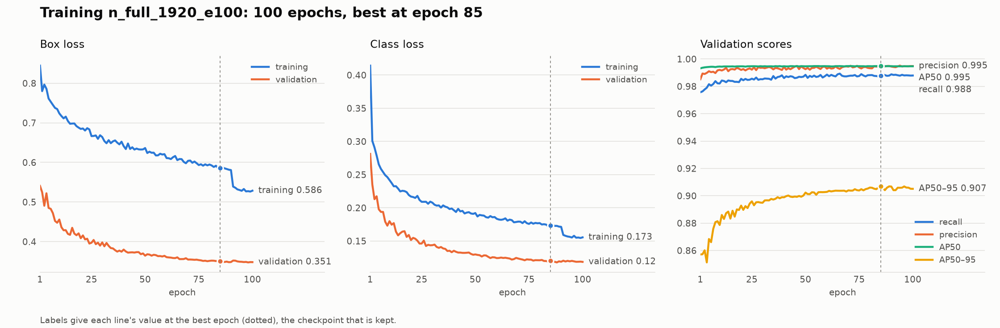
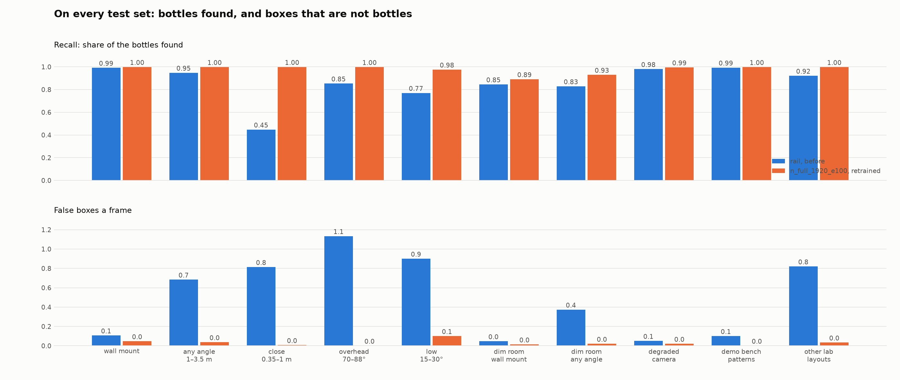
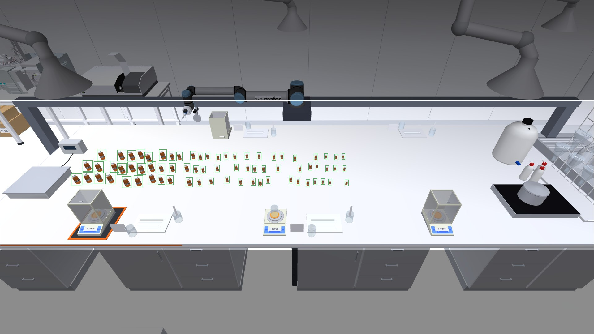

# Training the bench vial detector: data, training, results, and how to repeat it in Isaac Sim

This is the one document about the bench vial detector (YOLO26n, one class,
`amber_bottle`). It covers how the training images are generated in MuJoCo, how
the training set is chosen from them, how the model is trained and scored, what
has been measured so far, what to present at the demo, and how to repeat the
whole thing with frames rendered in Isaac Sim instead. It replaces
`YOLO26_STUDY.md`, `YOLO26_PLAN.md` and `YOLO26_TRAINING_PIPELINE.md`.

Written 2026-09-19, updated 2026-09-20 with the full dataset and the trained
models. Every number is one of:

- **measured**: from a run that happened, with the script that produced it;
- **decided**: by Martí;
- **estimate** or **proposed**: not run, or not agreed.

**Status in one paragraph.** The dataset is rendered: 10,300 MuJoCo frames with
216,876 exactly labelled vials, from the wall camera, any angle, close up and
low cameras, on benches laid out in rows, clusters and crowds of up to 75
flasks, in a lab that changes around the bench (measured). 5,844 of them train
the model. **The model is trained and scored: `yolo26n_full_1920_e100.pt`,
threshold 0.52, backend `full`** (measured): it finds as many vials as the old
detector from the robot's wall camera (recall 0.991 to 0.999, with fewer false
boxes) and far more from everywhere else (0.447 to 0.998 under a metre). What
has not been done: timing it on the demo's Mac, scoring it on a real
photograph, and training on Isaac frames.

**Where things are.** The model to use and how to point each program at it:
`computer-vision/weights/README.md`. The weights are not in git: team Drive,
**General MAFER AI › hackathon › weights**. The dataset's record, its review
page and how to regenerate it: `docs/presentacion/dataset_viales/README.md`
(Spanish) and https://claude.ai/artifact/9sFAnHGXH6hzXr366sKU12 (private). The
code of everything below is on the branch `vision/orbit-dataset`; `main` holds
an earlier state of it (merged at `5c6925c`), without the bench patterns, the
lab variation and the pod scripts of the full dataset.

## 1. The target (decided)

| | |
| --- | --- |
| Model | **YOLO26n**, fine-tuned from the previous detector, `weights/yolo26n_rail_general.pt` (`rail`). Larger models were dropped: the nano scored 0.99 on the view the robot uses, and what it lacked was data (section 6) |
| Input | **The part of the frame the bench occupies, at the frame's native 1920 px.** That is what the demo runs: the viewer on `main` crops rows 30 to 75 % of the frame at full width (1920 x 486, `view/backend/table_crop.py`) and predicts at native size. Training crops every frame the same way (section 4) and trains at `imgsz 1920`, so the model is trained on what it will see |
| Demo machine | A teammate's Mac with a GPU and 128 GB. `vision_pick.py` already picks `mps` there. Not timed yet (section 8) |
| Training data | MuJoCo renders only. Isaac is the second renderer this document prepares for (section 11) |
| Camera | `general`: GoPro Linear, 1920 x 1080, fovy 60.44 (f = 927 px), on the aisle wall 3 m up, looking down at the bench |
| Objects | amber glass vials, 10 to 100 ml, on the rail scene's 6 x 2 m desk (`minihannover_rail_scene.xml`, UR10e on a 6 m rail); 9 to 36 px tall from the wall mount |
| Classes | one. Identity is the barcode and ring reader's job, not the detector's |
| Latency | 100 ms a frame |
| Light | its variety matters less than elevation and distance: dark frames are tests, not training |

## 2. The pipeline at a glance

```
scene (MJCF, as committed, never written)
  -> per frame, from seed = split.seed + k:
       bottle layout -> arm pose -> light and worktop tint -> camera pose
  -> render RGB + 3 segmentation passes            fixedcam_dataset.py
  -> gt.json: exact box, visible fraction, camera pose of every frame
  -> optional degradation (blur, noise, JPEG, gamma)
  -> check the render                              dataset_report.py
     (the two steps above on a pod:                pod_run_dataset.sh)
  -> select the training set, even over poses      select_frames.py
  -> draw where the camera stood                   pose_map.py
  -> crop to the bench, YOLO labels                fixedcam_to_yolo.py --crop
  -> fine-tune YOLO26n at 1920 px on a GPU pod     runs/orbit/train_yolo26_gpu.py
  -> score old and new on every test set           viewpoint_study.py --crop
  -> find where each breaks                        limits_sweep.py
  -> the ten demo benches as the viewer frames them  demo_patterns_check.py
  -> figures for the presentation                  training_plots.py
  -> time it on the demo machine                   export_and_time.py
```

`scripts/train_pod.sh` runs select to figures unattended on a pod. Everything
downstream of `gt.json` reads only `gt.json` and the frames, which is what
makes the Isaac route of section 11 a change of renderer and nothing else.

The dataset can be regenerated from its code and seeds alone: the same seeds
give the same frames on any machine. **Never change an existing split's
definition or `EXTRA_PER_SIZE`**: that silently changes what its seeds render.
New data gets new splits with new seeds.

## 3. Generating the frames in MuJoCo

Script: `scripts/fixedcam_dataset.py`. The scene is loaded through
`render_perfumery.Lab`, which adds extra labelled bottles in memory
(`EXTRA_PER_SIZE = 3` of every bottle size of both kits, on top of the scene's
own). Each frame draws the steps below, in this order, from its own seed.

### 3.1 The bench: `lay_out`, and the seeded patterns

All movable bottles are parked, then the bench is laid out one of three ways:

- **as built** (10 % of training frames, 20 % of test frames): the scene's own
  vessels where the scene file puts them, the bench the robot actually meets;
- **a seeded pattern** (half of the rest): `simulation/scripts/bottle_patterns.py`
  draws a whole worktop from one integer, 10 to 75 flasks, 4 to 60 mm apart,
  scattered, in several clusters, **in rack-like rows** or **crowded into one
  stretch**. `lay_out_pattern` stands a movable vial of the same radius (or the
  next smaller one left) on each of its spots, and leaves a spot out when
  something else stands there. Training draws pattern seeds between 1,000 and
  1,000,000 and **never one of the ten catalogued seeds** (p01 to p10: 30, 176,
  21, 327, 1, 31, 70, 4, 2, 15), which are what the viewer shows and what
  `pattern_test` and `pattern_orbit_test` keep for themselves;
- **the renderer's own layout** (the other half): 8 to 34 vials on free worktop
  by ray casts, 35 % of them a cluster of 15 x 12 cm round one point.

`EXTRA_PER_SIZE = 15` extra labelled vials of each of the five sizes are added
in memory, 94 movable vials in all, so that 75 fit. Every sample vial in view is
labelled wherever it stands, and tagged with `where`. What was drawn goes into
the frame's `randomisation.layout` (style, pattern seed, count, spacing).

Measured over the 10,300 frames: renderer's scatter 4,090, its cluster 1,610,
as built 1,146, pattern rows 1,172, pattern clusters 1,154, pattern crowd
1,128; up to 75 vials a frame.

### 3.2 Arm pose (`pose_arm`)

- 75 % of frames: the UR10e reaches a random point 5 to 40 cm above the
  worktop with the rail scene's own IK (`rail_kinematics.reach`), so it leans
  over the bench and hides bottles the way it will when working.
- Otherwise the carriage is parked at a random x along the rail.

### 3.3 Light, materials, and the lab around the bench

| Knob | Training draw |
| --- | --- |
| Light intensity | x U(0.55, 1.45) on every light |
| Light colour | per channel x N(1, 0.035), clipped to 0.9 to 1.1 |
| Headlight | diffuse and ambient each x U(0.55, 1.45) |
| Worktop tint | 50 % of frames: the worktop's colour x U(0.78, 1.0), hue within 2 % |
| Dark frames | none in training (decided): 8 to 50 % of the light only in `dark_test` and `orbit_dark_test` |

**A varied lab** (`Randomiser.vary_lab`) in 70 % of training and validation
frames; the other 30 % keep the lab as it is, the one the robot works in. The
bench, the rail, the arm and the vials are never touched:

- **appearance**: about half the room's materials, and its bare-coloured walls
  and floor, are tinted, brightness x U(0.55, 1.08) and hue off by N(0, 9 %);
  the ceiling lights move by N(0, 0.4 m) and up to a third are switched off;
- **arrangement**: whole families of furniture and clutter are taken away, each
  with 35 % chance (chairs, stools, cartons and their tape and labels, drums,
  coats, bins, the carboy); and, unless the frame keeps the as-built bench, each
  of four balances, the GC-MS and the UV-Vis is slid along the bench by up to
  0.5 m (50 %), taken away (20 %) or left (30 %). The sink and the open balance
  the beaker stands on stay. This happens before the bench is laid out, so the
  vials avoid the instruments where they now stand.

Textures are not swapped and no new objects are added. What changed is recorded
in `randomisation.lab`. `lab_test` and `lab_rail_test` are varied labs from
seeds of their own. Light and lab are drawn per frame, so their variety costs
no frames: the image count is set by the camera poses to cover (section 7).

### 3.4 The camera: four families of viewpoints

All four render at 1920 x 1080.

**Wall mount (`rail_*`)**: the `general` camera where it is mounted, jittered in
training by N(0, 7 cm) per axis, clipped to 15 cm, and turned by N(0, 2) degrees
about a random axis, clipped to 5 degrees. The shift only goes into the room and
down (measured bug: the mount is flush with the wall and the ceiling, and a
third of the jittered frames of an earlier split put the lens inside them and
came out flat grey with no bottle in view).

**Orbit (`orbit_*`)**: the camera stands anywhere in the room and looks at an
**aim point** on the bench (`Randomiser.orbit`):

1. Aim point: 70 % of the time a bottle standing on the bench, moved in x and
   y by N(0, spread), with spread = `AIM_SPREAD_M` (25 cm) scaled by the
   split's distance range against the orbit's; otherwise a uniform point of
   the worktop. Its height is 0 to 10 cm above the worktop.
2. Direction from the aim point: azimuth U(0, 360) degrees; elevation U(30, 85)
   degrees above the bench plane (below 30 the view grazes the bench); 20 % of
   poses are **overhead**, U(70, 88) degrees (short of 90, where a look-at has
   no up).
3. Distance to the aim point: U(1, 3.5) m.
4. Lens: fovy U(48, 72) degrees around the GoPro's 60.44; roll N(0, 4)
   degrees, clipped to 8.
5. Checks, else redraw (up to 200 tries): the camera is inside the room box
   (`ORBIT_ROOM`, inside the walls, under the ceiling at 2.85 m, short of the
   corridor); nothing blocks the first 85 % of the line of sight to the aim
   point (the last stretch may cross bottles and the arm); and a ray from
   outside to the lens meets nothing, so the lens is not inside a wall, the
   shelf or the arm.
6. Pose: `look_at_quat(position, aim)` then the roll about the line of sight.

The ceiling limits the steep views from afar: with the worktop at 0.90 m and
the ceiling cap at 2.85 m, a camera can rise at most about 1.95 m over its aim
point, so at 2.5 to 3.5 m the elevation cannot pass about 34 to 51 degrees.
Those cells of the grid in section 7 are empty for that reason (measured).

**Close (`close_*`)**: the same sampler at 0.35 to 1 m, so a bottle is 30 to
300 px tall. The aim spread is 7.5 cm here: with the orbit's 25 cm, 2 of the
first 4 preview frames showed no vial, because the frame is only about half a
metre wide this close (measured, then fixed).

**Low (`low_*`)**: the same sampler 15 to 30 degrees above the bench, 0.5 to
3.5 m away: a camera at eye height across the bench. The previous detector lost
4 to 11 points of recall there (section 6.2).

An orbit, close or low pose that shows no vial at least 30 % visible is drawn
again, twice at most: the first render had 188 such frames, this one has 4.

Bottle heights in the first render's preview (measured, sampled frames):

| Family | Frames sampled | Boxes | Height p5 / p50 / p95 / max |
| --- | ---: | ---: | --- |
| wall mount | 76 | 1,575 | 14 / 22 / 35 / 39 px |
| orbit | 96 | 1,177 | 13 / 31 / 66 / 129 px |
| close | 56 | 248 | 33 / 78 / 174 / 261 px |

### 3.5 Degradation (`degrade`)

30 % of training frames (100 % of `*_shift` frames) are degraded after
rendering, as a real camera and its encoder would: gamma U(0.8, 1.25) and
contrast U(0.85, 1.1); 70 % a Gaussian blur of sigma U(0.3, 1.2); 80 % sensor
noise of sigma U(1, 6); 80 % JPEG at quality 55 to 95. The parameters drawn are
stored in the frame's record.

### 3.6 Ground truth (`render_perfumery.Lab.render`)

The simulator's state writes the truth and nothing else; the detector only ever
sees the RGB frame. Each frame has three segmentation passes:

- **visible**: every geom except see-through glass (alpha < 0.6), so a bottle
  behind a draft shield still counts as visible. Gives the visible box, `xyxy`;
- **samples only**: the full, unoccluded silhouette of every sample bottle.
  Gives `full_xyxy`, and `visible_frac` = visible pixels / full pixels;
- **category map**: sample, shelf bottle, glassware, balance, instrument,
  other. Used to say what a false box fired on.

A bottle is labelled for training when `visible_frac >= 0.3`
(`fixedcam_crops.MIN_VISIBLE`); the ones hidden further are left out rather
than taught as bottles the model cannot see.

Measured bug: NVIDIA's EGL multisamples the offscreen buffer, so at edges a
segmentation pixel averaged two geoms' id colours and read back as a third geom
or an id past the last one. Segmentation now has its own renderer with
`offsamples = 0`; the boxes are identical to those rendered on Windows.

### 3.7 Splits and seeds

Frame `k` of a split uses seed `split.seed + k`, and every split has its own
range of seeds. Checked on the labels of the render (measured): **no frame seed
is shared** between training, validation and test, and no catalogued pattern
appears in training. Two things are not perfectly apart, and neither matters:
pattern seeds are drawn from a million values, so 3 benches of about 2,500
coincide by chance between training and validation or test (same vials, other
camera, light, arm and room); and the as-built bench is the same bench in every
split on purpose. Tests keep the light nominal, the frames clean and the lab
unvaried unless their name says otherwise.

| Split | Camera | Frames | Role |
| --- | --- | ---: | --- |
| `rail_train` / `rail_val` | wall mount, jittered | 2,500 / 250 | training and validation |
| `orbit_train` / `orbit_val` | orbit, 1 to 3.5 m, 30 to 88 degrees | 3,000 / 300 | |
| `close_train` / `close_val` | orbit, 0.35 to 1 m | 1,500 / 150 | |
| `low_train` / `low_val` | orbit, 15 to 30 degrees | 800 / 100 | |
| `rail_test` | wall mount, nominal | 150 | the camera the robot uses; no model may lose here |
| `pattern_test` / `pattern_orbit_test` | wall mount / orbit | 100 / 100 | the ten catalogued benches of the demo, 10 frames each, never trained on |
| `lab_rail_test` / `lab_test` | wall mount / orbit | 100 / 150 | varied labs |
| `orbit_test`, `close_test`, `low_test`, `overhead_test` | as named | 300 / 150 / 100 / 150 | each view on its own |
| `rail_test_shift` | wall mount, strong light, every frame degraded | 100 | proxy for another renderer or a real GoPro |
| `dark_test`, `orbit_dark_test` | 8 to 50 % of the light | 150 each | reported, not trained for |
| `test_open` | wall mount, the open scene | 100 | another lab entirely; not rendered |

### 3.8 The render that exists (measured)

**10,300 frames** (7,800 training, 800 validation, 1,700 test), **216,876
labelled vials**, 8.1 GB: wall mount 3,350 frames and 99,235 vials, orbit 4,150
and 77,157, close 1,800 and 19,797, low 1,000 and 20,687. Rendered in **10.5
minutes** on an RTX 4090 pod in RunPod's EU-RO-1 (112 CPUs, 24 parallel MuJoCo
EGL processes, about 0.15 USD). `dataset_report.py` flags 4 frames with no vial
and 14 with low contrast (9 close views of bare worktop with one vial, 5 dark
by design), none with the camera inside geometry, and no bench vial lost to the
crop. 68 frames rendered again on a Windows laptop from the same seeds carry
exactly the pod's boxes: the seeds do regenerate the dataset.

```bash
bash computer-vision/scripts/pod_run_dataset.sh    # on the pod, as /root/repo/pod_run.sh
```

renders every split in parallel parts (`--part i/n`, then `--merge`), repeats
the parts that fail, checks the counts, runs `dataset_report.py` and hands over
to `train_pod.sh`. It skips the splits whose `gt.json` is already complete, so
a new pod on the same volume goes straight to training.

Where it is: RunPod network volume `hackspain-orbit-dataset` (id `mwd17cd5k8`,
25 GB, EU-RO-1), frames at `/workspace/fixedcam_v2`, the code that rendered them
at `/workspace/code_v2`. The first render (9,400 frames, one bench style, one
lab) is still at `/workspace/fixedcam`; this one replaces it. A pod created in
EU-RO-1 with that `networkVolumeId` mounts the frames with no upload.

## 4. Cropping

**At inference: the bench band (measured).** From the wall mount the bench
always lies between rows 352 and 800 of the 1080. Running `rail` on that
1920 x 448 band alone gives the same accuracy as the whole frame (AP50 0.990,
recall 0.993, 1.2 false boxes a frame at threshold 0.10) in about 0.40x the
time: about 93 ms instead of 233 ms with PyTorch on the laptop's CPU. With
OpenVINO fp16 at a fixed 1920 x 512 input it is 80 ms median (90th percentile
103 ms) with the CPU half busy, against 154 ms for the whole frame
(`scripts/export_and_time.py`). Pass `imgsz=(512, 1920)` to `predict`, or
OpenVINO recompiles on every call and runs about 5x slower. On `main` the
viewer already crops live and replay frames to a fixed band, 30 to 75 % of the
frame's height at full width (`view/backend/table_crop.py`; replay runs `rail`
at 1280 px and 0.47). `labvision/detector.py` does not crop yet, and
`bench_crop.py` (below) computes the band from the camera instead of fixed
fractions.

**At training: every frame cropped to the bench (implemented).**
`scripts/bench_crop.py` projects the worktop box (x -4.5 to 1.5 m, y -1.4 to
0.6 m, from the bench top at z 0.90 m to above the tallest vial at 1.10 m) with
the frame's own camera (`cam_pos`, `cam_xmat`, `fovy_deg` from `gt.json`), pads
it by 8 px and snaps it to multiples of 32 px, the network's stride. From the
wall camera that is a band of about 1920 x 448 to 576 (the jitter moves it); an
orbit frame keeps about 78 % of its pixels on average. `fixedcam_to_yolo.py
--crop` cuts the images and moves the labels, and drops a vial the crop leaves
with under 60 % of its box (`bench_crop.KEEP`). The crop needs only the
camera's pose and field of view, so the same function serves the real camera
from its calibration. What it buys: no training pixels spent on walls and
ceiling, more bottles per mosaic, and the model sees each view as it will run.

Training on 640 px tiles of the crop was considered and dropped: it buys
training time, which at about an hour is not the constraint, and a model
trained on tiles is unproven on the whole band it has to run on.

## 5. Training (measured)

The same run twice, 25 epochs and 100 epochs, everything else equal. Everything
not listed is the default of Ultralytics 8.4.155; the run folder's `args.yaml`
records every value used, and is saved.

| | |
| --- | --- |
| Script | `runs/orbit/train_yolo26_gpu.py DATA --size n --imgsz 1920 --weights weights/yolo26n_rail_general.pt --name n_full_1920 --epochs 100 --patience 20` |
| Start | `rail`'s weights, not COCO: it already scored 0.99 on the wall mount, and `rail` itself came from `yolo26n.pt` (COCO) |
| Data | `sel_train` and `sel_val` (section 7), every frame cropped to the bench, one class |
| Input | `imgsz 1920`. Ultralytics resizes each image's long side to 1920 and builds square mosaics, so a wall-mount band (1920 wide) keeps its native pixels |
| Epochs | 25 with `patience 8`, and 100 with `patience 20`. Neither stopped early |
| Batch | 8; 15 to 16.5 GB of the 24 GB |
| Random scale | `scale 0.5`, +-50 %: vial heights span 10 to 300 px. (`rail` used 0.25, when they spanned 9 to 36) |
| Other augmentation, defaults | mosaic 1.0, off for the last 10 epochs; horizontal flip 0.5, no vertical flip; HSV 0.015 / 0.7 / 0.4; translate 0.1; random erasing 0.4; no rotation, shear, perspective, mixup or copy-paste |
| Optimiser | `optimizer auto`, which chose AdamW at lr 0.002, momentum 0.9; linear decay to `lrf 0.01` over the run's epochs; weight decay 0.0005; 3 warm-up epochs; AMP on; loss gains box 7.5 / cls 0.5 / dfl 1.5 |
| Frames read | from the pod's own disk, uncached, 12 loader workers. `cache="ram"` wants 28 GB for this set and got the process killed |
| Seed | 0 |
| Checkpoint kept | `best.pt`, the epoch with the best validation fitness (0.1 x AP50 + 0.9 x AP50-95) |
| Machine | RunPod, RTX 4090 24 GB, 83 GB RAM, 0.74 USD an hour |

| run | time | an epoch | best validation (750 frames, 15,253 vials) |
| --- | --- | --- | --- |
| 25 epochs | 53 min | 2.1 min | epoch 25: recall 0.985, precision 0.992, AP50 0.995, AP50-95 0.899 |
| 100 epochs | 4 h 10 min | 2.5 min | epoch 85: recall 0.988, precision 0.995, AP50 0.995, AP50-95 0.907 |

At epoch 8 the two runs stood at the same 0.881 AP50-95, as they should: same
data, same seed. They part afterwards because the learning rate decays over the
whole run, so the 100-epoch run is still learning fast when the 25-epoch one
has wound down. Validation was still creeping up at epoch 90 (about 0.003
AP50-95 every ten epochs); nothing suggests overfitting.



**What a run leaves behind** (`train_pod.sh` copies it all to `$OUT`; both
runs' folders are kept in `docs/presentacion/dataset_viales/entrenamiento_e25`
and `entrenamiento_e100` of the main checkout):

| file | what it is | show it? |
| --- | --- | --- |
| `weights/<name>.pt` | the model | |
| `run/results.csv`, `run/args.yaml` | every epoch's losses and scores; every hyperparameter | |
| `run/results.png`, `BoxPR_curve.png`, `BoxF1_curve.png`, `confusion_matrix.png` | Ultralytics' own plots | backup slides |
| `run/train_batch*.jpg`, `val_batch*_pred.jpg` | mosaics as the model saw them; its boxes on validation frames | yes: the quickest proof it works |
| `plots/pose_map_train.png` | where the camera stood in every training frame (section 7) | **yes** |
| `plots/training_curves.png` | losses and validation scores by epoch, best epoch marked | **yes** |
| `plots/before_after.png` | `rail` against the new model on every test set | **yes** |
| `score_*.md`, `viewpoint/` | the numbers behind it, by elevation, distance and vial size, and every box of both models on every test frame | |

The whole night cost about 6 USD of pod time, three failed starts included
(section 8.3).

## 6. Scoring, and the results

- `scripts/viewpoint_study.py WEIGHTS --crop --pick-on sel_val --splits ...`:
  recall, false boxes a frame and AP50 per test set, broken down by camera
  elevation, distance, vial height in pixels and place in the frame. `--crop`
  predicts on the bench crop, as the model is trained and run. The threshold
  is the best-F1 threshold on the validation set, never on a test. A box is
  right at IoU 0.5 with a vial no other box has taken. YOLO26 predicts end to
  end, so there is no NMS threshold beside it.
- `scripts/limits_sweep.py WEIGHTS`: renders the same 12 bench layouts while
  one condition moves, and reports where recall breaks.
- `scripts/demo_patterns_check.py WEIGHTS`: the ten demo benches exactly as the
  viewer shows them (section 6.3).
- `scripts/fixedcam_bench.py`: the older per-split benchmark.

### 6.1 Every test, three models (measured)

The full test splits of the render, 37,261 vials in 1,700 frames that no model
trained on. Recall and false boxes a frame, each model at its own validation
threshold: `rail` 0.56, the 25-epoch run 0.41, the 100-epoch run 0.52.

| test | what it asks | `rail`, before | 25 epochs | **100 epochs** |
| --- | --- | --- | --- | --- |
| `rail_test` | the robot's wall camera | 0.991 · 0.11 | 0.998 · 0.14 | **0.999 · 0.05** |
| `pattern_test` | the ten demo benches, wall camera | 0.993 · 0.10 | 0.998 · 0.08 | **0.998 · 0.00** |
| `lab_rail_test` | a varied lab, wall camera | 0.985 · 0.08 | 0.998 · 0.14 | 0.998 · 0.06 |
| `rail_test_shift` | degraded camera, strong light | 0.980 · 0.05 | 0.993 · 0.16 | 0.995 · 0.02 |
| `orbit_test` | any angle, 1 to 3.5 m | 0.948 · 0.68 | 0.995 · 0.05 | 0.998 · 0.04 |
| `close_test` | under a metre | **0.447** · 0.81 | 0.999 · 0.05 | **0.998** · 0.01 |
| `overhead_test` | straight down | 0.853 · 1.13 | 0.999 · 0.02 | 0.998 · 0.00 |
| `low_test` | 15 to 30 degrees | 0.770 · 0.90 | 0.978 · 0.35 | 0.975 · 0.10 |
| `pattern_orbit_test` | the ten demo benches, any angle | 0.909 · 1.39 | 0.999 · 0.04 | 0.999 · 0.01 |
| `lab_test` | a varied lab, any angle | 0.921 · 0.82 | 0.999 · 0.09 | 0.998 · 0.03 |
| `dark_test` | dim room, wall camera | 0.845 · 0.05 | 0.908 · 0.11 | 0.891 · 0.01 |
| `orbit_dark_test` | dim room, any angle | 0.828 · 0.37 | 0.914 · 0.07 | 0.929 · 0.02 |



- **It does not lose where the robot looks from**, and it fixes everything that
  failed: near views, low cameras, overhead, the demo benches from any angle.
- **`rail` was already good from the wall mount**, rows of 71 flasks and varied
  labs included (0.993 and 0.985): the bench patterns and the lab variation
  were never its problem there. Its problem was the camera leaving the wall.
- **100 epochs against 25.** At their own thresholds they find the same and the
  longer run draws fewer false boxes. At one threshold, 0.47, over all twelve
  tests: 714 vials missed and 74 false boxes against 804 and 106; the order is
  the same at 0.41 and at 0.52. A real but small gain for four hours of GPU.
- **The threshold hardly matters to the new models.** For the 25-epoch run on
  `rail_test`, recall is 0.999 at 0.10 and 0.997 at 0.56 while false boxes go
  from 0.58 to 0.06 a frame. `rail` needed its threshold: at 0.10 it drew 1.6
  false boxes a frame from the wall and 6.9 from close.
- Still the weakest: low cameras (0.975) and a dim room (0.89 to 0.93).

All of it is MuJoCo, from the generator the training frames came from, on
benches, cameras, lights and rooms it had not seen. It is not a promise about a
real camera.

### 6.2 How far it goes, before and after (measured)

`limits_sweep.py`: 12 layouts of 24 vials a level, whole frames at 1920 px.
Light from the wall mount; distance at 30 degrees of elevation; elevation at
1.5 m. `rail` at its backend threshold 0.10, the new model at 0.52; recall,
with false boxes a frame in brackets.

| distance | 0.25 m | 0.35 m | 0.5 m | 0.75 m | 1 m | 1.5 m | 2.5 m | 3.5 m |
| --- | ---: | ---: | ---: | ---: | ---: | ---: | ---: | ---: |
| median vial height | 160 px | 136 px | 107 px | 82 px | 63 px | 43 px | 29 px | 21 px |
| `rail` | 0.31 (3.1) | 0.33 (3.8) | 0.47 (5.6) | 0.69 (11.8) | 0.85 (11.1) | 0.98 (8.4) | 0.96 (6.0) | 0.96 (7.6) |
| new | **1.00** (0.1) | 0.99 (0.0) | **1.00** (0.1) | 0.99 (0.1) | 1.00 (0.0) | 0.99 (0.1) | 0.96 (0.0) | 0.97 (0.0) |

| elevation | 10 | 20 | 30 | 45 | 60 | 75 | 88 degrees |
| --- | ---: | ---: | ---: | ---: | ---: | ---: | ---: |
| `rail` | 0.89 (10.9) | 0.94 (13.6) | 0.98 (8.4) | 1.00 (5.0) | 0.99 (3.1) | 0.97 (4.2) | 0.95 (4.8) |
| new | 0.99 (0.1) | 0.98 (0.0) | 0.99 (0.1) | 1.00 (0.1) | 1.00 (0.1) | 1.00 (0.0) | 1.00 (0.0) |

| light left | 100 % | 50 % | 30 % | 20 % | 15 % | 10 % | 6 % | 3 % |
| --- | ---: | ---: | ---: | ---: | ---: | ---: | ---: | ---: |
| `rail`, at 0.10 | 0.996 | 0.996 | 0.996 | 0.978 | 0.951 | 0.511 | 0.000 | 0.000 |
| new, at 0.10 | 0.993 | 0.985 | 0.981 | 0.981 | 0.963 | 0.552 | 0.007 | 0.000 |
| new, at 0.52 | 0.993 | 0.985 | 0.981 | 0.974 | 0.910 | 0.284 | 0.000 | 0.000 |

- **Near is fixed**: from 0.31 to 1.00 at 0.25 m, where a vial is 160 px tall,
  and the fragment boxes that came with it are gone.
- **The angle no longer matters**, down to 10 degrees, below what was trained.
- **Far is unchanged**: 0.96 to 0.97 at 2.5 to 3.5 m, 21 to 29 px vials.
- **The dark is unchanged, as decided**: no dark frame was trained on, and at
  one threshold the two models fall off the same cliff between 15 % and 10 %
  of the light. At its own higher threshold the new model goes blind a little
  earlier (0.91 at 15 %); neither invents boxes in the dark. If the demo dims
  the lights, lower the threshold with them or train on dark frames.

Why `rail` failed near, measured before retraining: it never saw a vial over
36 px, and broke a larger one into cap, label and body, each boxed as a small
vial: 266 of its 396 false boxes on the first `orbit_test`, recall 0.22 for
vials of 96 to 160 px and 0.00 above.

### 6.3 The ten demo benches as the viewer shows them (measured)

`demo_patterns_check.py` builds each catalogued pattern with the viewer's own
scene builder (`view/backend/scene_patterns.py`), renders the `general` camera
at 1920 x 1080 with the arm in its starting pose, crops the table band as the
viewer does (`table_crop.py`) and predicts at native size. Truth is a
segmentation render of the same frame; a flask counts when 30 % of it shows.

| model | flasks found | false boxes | benches with everything found |
| --- | ---: | ---: | ---: |
| `rail`, at the viewer's 0.47 | 428 / 435 | 3 | 6 of 10 |
| 25 epochs, at 0.41 | 430 / 435 | 0 | 7 of 10 |
| 100 epochs, at 0.52 | 430 / 435 | 0 | 7 of 10 |

The five flasks the new models miss (one in p02, one in p06, three in p09) are
all the same case: a small flask right behind a large one, with only the cap
showing. No flask in plain view is missed. That is the wrist camera's job, not
the fixed detector's.



The viewer's **Replay** mode does not show MuJoCo: its `rail_global.mp4` videos
are rendered by IsaacLab (`render_rail_isaaclab.py`), 960 x 540, same framing.
On the first frame of each, cropped and sized as the replay does (1280 px,
0.47), the MuJoCo-trained 25-epoch model drew 424 boxes for 436 flasks and
`rail` 410. Those are counts, not matches: there is no truth for those frames.

### 6.4 Latency (measured on the i5 laptop only)

Whole `predict` calls, nano, one frame. PyTorch on the idle CPU: 233 ms whole
frame at 1920, about 93 ms on the 1920 x 448 band. OpenVINO fp16 with a fixed
input shape is 3 to 4 times faster with identical boxes: 80 ms median on the
band, p90 103 ms. A dynamic shape recompiles every call and runs about 5 times
slower. The detector process holds 0.5 to 0.75 GB. This is the fallback
machine; the demo's Mac has not been timed (section 8.2).

## 7. The training set (measured)

Priorities (decided): many elevations and distances, little weight on light,
and few enough images to train in hours, not days. Light, tint, degradation and
the varied lab are drawn per frame and cost no frames; the count is set by how
many camera poses have to be covered. So the set is **selected** from the
render, evenly over poses, by `scripts/select_frames.py`:

- **wall mount**: the first 2,000 frames of `rail_train` by seed, and the first
  200 of `rail_val`;
- **orbit, close and low together**, on a grid of 5 elevation bands by 5
  distance bands: at most 200 frames a cell, taken round-robin over twelve
  30-degree bearings, so a capped cell still looks at the bench from all round;
- **validation**: every frame of `orbit_val`, `close_val` and `low_val`;
- no dark frames: none are rendered into training now, and the script still
  leaves any out.

Frames kept / rendered, per cell (measured; the same render always gives the
same selection, and the pod and a laptop gave the same one):

| elevation \ distance | 0.35-0.6 m | 0.6-1 m | 1-1.75 m | 1.75-2.5 m | 2.5-3.5 m |
| --- | ---: | ---: | ---: | ---: | ---: |
| 15-30 degrees | 22 / 22 | 131 / 131 | 200 / 225 | 200 / 200 | 200 / 221 |
| 30-45 degrees | 134 / 134 | 200 / 216 | 200 / 370 | 200 / 350 | 200 / 276 |
| 45-60 degrees | 120 / 120 | 200 / 204 | 200 / 381 | 200 / 294 | 11 / 11 |
| 60-75 degrees | 161 / 161 | 200 / 241 | 200 / 519 | 177 / 177 | 0 / 0 |
| 75-88 degrees | 167 / 167 | 200 / 257 | 200 / 502 | 121 / 121 | 0 / 0 |

The empty cells are the ceiling: with the worktop at 0.90 m and the camera
capped at 2.85 m, a view from 2.5 m or more cannot be steeper than about 50
degrees. They do not exist in this room and are not a gap to fill. The low,
very close cell is thin (22) because the low splits start at 0.5 m.

| | train | val |
| --- | ---: | ---: |
| wall mount | 2,000 | 200 |
| orbit, 1 to 3.5 m | 1,709 | 300 |
| close, under 1 m | 1,382 | 150 |
| low, 15 to 30 degrees | 753 | 100 |
| **total** | **5,844** | **750** |

**The pose map.** `scripts/pose_map.py sel_train` draws where the camera stood
in every training frame: the bench from above, overhead views at the centre,
shaded by distance, and the count of every grid cell. It is the figure to show
for "what did the model train on", and the check to run on any training set
before paying for its training: a missing bearing or an empty cell shows at
once. It reads only `gt.json`, so it draws an Isaac dataset the same way.


The interactive version, with every thumbnail, filters by camera, use, bench
style and lab, examples of every split and the results of section 6:
https://claude.ai/artifact/9sFAnHGXH6hzXr366sKU12 (private; offline in
`docs/presentacion/dataset_viales/pagina_v3/index.html` of the main checkout).

## 8. State and next steps

### 8.1 Where everything is

| what | where |
| --- | --- |
| The model to use | `yolo26n_full_1920_e100.pt`, threshold 0.52, backend `full`: `computer-vision/weights/README.md`. Team Drive, General MAFER AI > hackathon > weights (upload pending: the folders are ready in `docs/presentacion/dataset_viales/para_drive/` of the main checkout) |
| Frames (10,300, 8.1 GB) | RunPod network volume `hackspain-orbit-dataset` (`mwd17cd5k8`, 25 GB, EU-RO-1), `/workspace/fixedcam_v2`; the code that rendered them at `/workspace/code_v2`; both runs' outputs at `/workspace/out_v2` and `/workspace/out_v2_e100` |
| Labels of every frame, the report, both runs' plots and scores | `docs/presentacion/dataset_viales/` of the main checkout, with a README (Spanish) |
| Review page | https://claude.ai/artifact/9sFAnHGXH6hzXr366sKU12, built by `dataset_viales/fuentes/build_page3.py` |
| Code | branch `vision/orbit-dataset`, committed; `main` has an earlier state of it |
| RunPod access | key in `~/.runpod-render/api_key` on Marti's laptop (never print it); pods `isaac-*` are not part of this work |

### 8.2 What is left, in order of value

1. **Time the model on the demo's Mac**, with the viewer running, since the
   detector shares the GPU with the MuJoCo render:
   ```bash
   python scripts/export_and_time.py full --format torch --device mps --band 512
   python scripts/export_and_time.py full --format coreml --band 512
   ```
   Neither path of the script has run on a Mac yet.
2. **Make the programs default to it.** `vision_pick.py`'s `DETECTORS`, the
   viewer's `VIEW_DETECTOR` and `live_scan.py` still name `rail`; until they
   change, use the flags in `weights/README.md`. Prefer the new file when it is
   on disk and fall back to the old one, or a checkout without it breaks.
3. **Crop in `labvision`.** Today only the viewer crops to the bench, with
   fixed fractions; `labvision/detector.py` should crop with `bench_crop` so
   every caller runs the model as it was trained.
4. **Merge the branch into `main`.**
5. **Score a real photograph.** Everything here is MuJoCo (section 10).
6. **Isaac frames** (section 11).
7. Delete the first render from the volume (`/workspace/fixedcam`, 7.4 GB) once
   nobody needs it; the volume costs about 1.75 USD a month.

### 8.3 Gotchas met on the way

- **The pod takes one bundle and no commands.** Its boot script waits for an
  upload over HTTPS, unpacks it and runs `pod_run.sh`; there is no shell
  afterwards. A fix means a new pod, so every stage of the pod scripts skips
  what is already on the volume. Three starts were lost this way:
  - **the volume has a quota and no hard links**: `select_frames.py` fell back
    to copying 6,600 frames onto it and the run died at the quota. It now links
    symbolically, and the selection and the cropped dataset live on the pod's
    own disk;
  - **`cache="ram"`** asked for 28 GB with 16 loader workers and the trainer was
    killed for memory: the container's limit is far under the host's RAM;
  - **an inherited variable**: `train_pod.sh` used `DATA` for its YOLO export
    and the render script had exported `DATA` for the frames, so the crops went
    onto the volume. Do not share generic names between scripts.
- **A laptop that loses the network** leaves a pod idle at full price: the
  upload failed silently once and the pod waited 44 minutes for it.
- **`viewpoint_study.py` overwrites its result file** per detector name, so a
  second run with another threshold silently changes what a figure reads.

- **Laptop network:** only ports 80 and 443 get out, so no SSH to pods. Drive
  them through a small upload server behind RunPod's HTTPS proxy
  (`https://<pod>-8000.proxy.runpod.net`): PUT a tarball, the boot script
  unpacks it and runs `pod_run.sh`, progress in `/root/out/STAGE`.
- **Pod image:** `runpod/pytorch:2.8.0-py3.11-cuda12.8.1-cudnn-devel-ubuntu22.04`
  boots in about 30 s; a 2.4.0 image hung 16 min. Pin `allowedCudaVersions`
  to 12.8 and 13.0 (driver 570/580).
- **Network volumes** exist in EU-RO-1, not in CA-MTL-1.
- **Windows to pod:** shell scripts checked out on Windows have CRLF endings;
  strip `\r` on the pod. Tar with `--owner=0 --group=0 --numeric-owner`, or
  root's untar fails on uid 197609. Git Bash's `tar` reads `C:` as a remote
  host: pass `--force-local`.
- **Ultralytics** nests `project=runs/x` under `runs/detect/`.
- **OpenVINO** needs a fixed `imgsz` at `predict`, or it recompiles every call.
- **The laptop's CPU** throttles under load (it fell to 20 % in an overnight
  run): run one heavy job at a time, and read timings taken under load as
  ratios.
- **A bug on `main`** since `773c702`: `render_perfumery.Lab(scene=...)`
  ignores `rp.SCENE`, so the `rail_*` splits of `fixedcam_dataset.py` render
  the gantry scene with no arm, and the IK crashes. Fixed on the branch only
  (`load_lab` and `fixedcam_twin.py` pass the scene).

## 9. What we learned

1. **The size of a bottle in the picture limited the current model, not the
   angle.** `rail` holds 0.97 recall at any elevation up to 75 degrees but
   breaks bottles taller than about 96 px into parts, because it never saw one
   over 36 px. Near views fix that; more bearings alone would not have.
2. **The look of the lab moves the scores more than the camera does.** With
   the camera fixed, a new scene cost 0.19 AP50, and between MuJoCo and Isaac
   the models nearly stopped working. Angles are covered now; appearance is not
   (section 10).
3. **The image count follows the coverage of camera poses.** Light, tint and
   degradation are drawn per frame and cost nothing. 1,500 frames were enough
   for one view, so the grid needs a few hundred frames a cell at most.
4. **The room shapes the grid.** The ceiling rules out steep views from far
   away. Cap the cells; do not try to fill them.
5. **Cropping to the bench is free accuracy-wise and 2.5x faster at
   inference.** At training it only saves time together with tiling at a
   smaller `imgsz`.
6. **The threshold belongs to the view.** 0.47 for the wall mount, 0.62 for
   orbit views: always pick it on validation frames of the views that will be
   run.
7. **The detector is not the scan's bottleneck.** It boxes 247 of 247 vials on
   the as-built bench. The fixed camera does miss 3 at the aisle edge, and the
   wrist camera reads those. The two-camera design (the fixed camera proposes,
   the wrist camera confirms) is what absorbs a detector's misses and false
   boxes.
8. **Check the renders, not only the numbers.** Every rendering bug was found
   by looking at frames: grey frames from a lens inside the wall, wrong
   segmentation ids from multisampling, the wrong scene loaded silently, empty
   close views from too wide an aim spread.
9. **Isaac Sim** (details in 11.1): layouts that never move leak between
   splits; boxes come per mesh part; unlabelled bottles become negatives; pose
   edits must go through Fabric; camera axes differ between APIs; prim paths
   say `SMP_0001`, not `SMP-0001`.

## 10. Edge cases, and how the robot adapts to a new lab

The render covers where the camera stands very widely, but only in one lab:
every frame is the rail scene, with the same room, bench, objects and amber
vials. Camera placement is what changes most visibly from one lab to another,
but it is not the only thing that changes, and it is not the one that has cost
the most so far. With the camera held fixed, moving from the gantry scene to
the open scene dropped the fine-tuned nano from AP50 0.864 to 0.675
(`docs/FIXED_CAMERA_BENCHMARK.md`).

### 10.1 What can change, and what the dataset covers

| Case | Covered by the render? | What is known |
| --- | --- | --- |
| Camera at another bearing or height, 30 to 88 degrees above the bench | yes | 0.948 before, 0.998 now |
| Camera below 30 degrees (eye height, across the bench) | yes, `low_*`, 15 to 30 degrees | 0.770 before, 0.975 now; 0.99 at 10 degrees in the sweep |
| Camera much nearer, so bottles are large (60 to 300 px) | yes, `close_*` | 0.447 before, 0.998 now; 1.00 at 0.25 m in the sweep |
| Looking straight down | yes, overhead poses + `overhead_test` | 0.853 and 1.1 false boxes a frame before, 0.998 and none now |
| Bottles in the frame's corners | yes | not broken out for the new model |
| Another lens: wide or fisheye, distortion, other resolution | fovy 48 to 72 only, no distortion, always 1920 x 1080 | undistort from calibration first |
| Another room: walls, floor, bench material, clutter | partly: the same room with its colours, lights, instruments and furniture varied (section 3.3) | 0.998 on varied labs; another room entirely (`test_open`) is not rendered, and an earlier model lost 0.19 AP50 to a change of scene |
| Look-alike objects: brown boxes, drums, amber reagent bottles | only what the scene holds; none added | `rail` drew 1.6 false boxes a frame on boxes, drums and the shelf rack from orbit views; the new model 0.04 in all |
| Other containers: clear glass, white HDPE, vials in racks, other caps | no, amber vials only | the model will miss them or box them unpredictably |
| Dense packing and occlusion by the arm | yes: rows and crowds of up to 75 flasks 4 to 60 mm apart, arm in every frame | 430 of 435 on the ten demo benches; a vial under 30 % visible is not labelled, so it is not found either |
| Dim room | tests only, by decision | unchanged: holds to about 15 % of the light, fails at 10 %, never invents boxes (section 6.2) |
| Windows, backlight, glare and reflections on glass | no | never rendered |
| Real sensor: noise, blur, JPEG, exposure | 30 % of training frames degraded | a degraded camera cost the earlier nano 0.10 AP50 |
| Motion blur | no | |
| Simulation to reality: real glass, real textures | no | the largest unknown: no real photograph has been scored yet |
| Operating threshold | set on validation | 0.52 for the current model, and it matters little to it (section 6.1) |
| Latency on the lab's computer | not measured on the demo's Mac | on the i5 laptop's CPU, 80 ms with the bench crop and OpenVINO |

### 10.2 How the robot adapts to a new lab (proposed)

1. **Calibrate the fixed camera** (intrinsics and pose relative to the bench).
   It gives the bench crop, the pixel-to-bench mapping, and whether the lens
   needs undistorting.
2. **Photograph the bench 20 to 50 times** with vials placed at random.
   Label them: pseudo-label with YOLO-World and correct by hand, as was done
   for Isaac's unlabelled vials. Score the model on them and set the threshold
   there.
3. **Fine-tune if recall is short**, on those photographs mixed with the
   simulated frames: minutes on a rented GPU.
4. **Lean on the two cameras.** The fixed camera proposes and the wrist camera
   confirms by reading the label. A false box costs one look, not a wrong
   pick. The wrist camera also finds vials the fixed camera misses, which is
   how the scan reaches 19 of 19.
5. **For a lab that is different in kind**, build its twin (MuJoCo or Isaac)
   and run this pipeline on it.

### 10.3 What the full dataset added, and what it did not

Three things the first render lacked are now in the data (section 3): the
seeded bench patterns, a varied lab, and cameras under 30 degrees. What the
results say about each:

- **Bench patterns.** `rail` already found 0.993 of the vials on the ten demo
  benches from the wall camera, so rows and crowds were not a gap there. From
  any angle it found 0.909 and the new model 0.999, but that gain is the
  camera's, not the pattern's: the new model does as well on its own layouts.
- **A varied lab.** The same story: 0.985 before from the wall camera, 0.998
  after. The variation is colours, lights, moved instruments and missing
  furniture of the same room; it is not another room. `test_open`, the open
  scene, would say more and has not been rendered.
- **Low cameras.** A real gap, closed: 0.770 to 0.975, and down to 10 degrees in
  the sweep.

Not covered by anything here: other containers (clear glass, HDPE), a hand in
the frame, windows and glare, motion blur, another room, and real photographs.
Swapping textures and adding look-alike objects (amber reagent bottles, brown
boxes next to the vials) are the next steps of lab variation if a real lab
turns out to need them; both are untried.

## 11. Replicating it in Isaac Sim

### 11.1 What Isaac already has, and what went wrong before

- The Isaac scene is the MuJoCo scene exported to USD:
  `simulation/scripts/export_usd.py` (MuJoCo's own USD exporter, no Isaac
  needed) writes `lab_usd/`, with every name sanitised to `[A-Za-z0-9_]`, so
  `SMP-0001` becomes `SMP_0001` in prim paths. Eloi's
  `simulation/scripts/dataset_gen_v3.py` renders it with Replicator's
  `BasicWriter`. Setup: `simulation/runpod-isaac.md` (official image
  `nvcr.io/nvidia/isaac-sim:4.5.0`, the `dockerEntrypoint` override, about
  4.5 min to first boot, no RTX 5090, driver 570/580).
- `lab_dataset_v1` and `v2` never moved the bottles (only light and a small
  camera jitter changed). A random frame split then leaks, and a model learns
  positions. `v3` reshuffles every bottle each state.
- Isaac boxed every mesh of a bottle separately (body, cap, label): 133,400
  boxes were 48,100 bottles. `isaac_dataset_to_yolo.py` merges them by union
  per (image, sample id).
- About 220 `stock_reserve` vials had no semantic label, so no box: positives
  taught as background. They were pseudo-labelled with YOLO-World as a stopgap.
- `v3` found that raw USD `xformOp` edits between renders do not reach the
  render (Fabric caches transforms), while light attribute edits do. Poses go
  through `isaacsim.core.prims.XFormPrim.set_world_poses` followed by
  `app.update()` before the render.
- Moving the cameras through Fabric flipped the `general` view in `v3`, so v3
  kept the cameras at their base poses. A likely cause is an axis convention:
  USD and MuJoCo cameras both look down -Z with +Y up, while Isaac's `Camera`
  helper defaults to a "world" convention (+X forward, +Z up). Check which one
  the call assumes.
- The model trained on Isaac's `v2` scored AP50 0.780 on its held-out camera
  but 0.574 on MuJoCo's `rail_test`, and MuJoCo-trained models found almost
  nothing on Isaac frames: the renderer gap is large in both directions.
- The MuJoCo twin camera did not overlay Isaac's `general` view exactly
  (fovy 36.28 in the twin), so intrinsics must be checked, not assumed.

### 11.2 Recommended approach: MuJoCo plans every frame, Isaac renders it (proposed)

Rather than re-implement the layout sampler, the IK, the ray checks and the
camera sampler in Isaac, let `fixedcam_dataset.py` draw each frame exactly as
it does now and write the resulting state; an Isaac script then only applies
that state and renders. Both simulators then show the same frame, which gives:

- the same distributions of layouts, arm poses, angles and distances, with no
  second implementation to keep in step;
- paired frames, so the renderer gap is measured frame by frame, and a
  MuJoCo + Isaac mix differs only in appearance;
- a check of Isaac's truth: its boxes should match MuJoCo's boxes of the same
  frame.

Steps:

1. **Export the rail scene.** `python simulation/scripts/export_usd.py
   simulation/models/minihannover_rail_scene.xml OUT` with the extra bottles of
   `EXTRA_PER_SIZE` included (they are added in memory by `render_perfumery`,
   so the export must go through the same `Lab` object, not the XML alone).
   Render at 1920 x 1080, not the 1600 x 900 of v1 to v3, so the crop and the
   pixel sizes match the GoPro.
2. **Dump the state per frame.** Add a `--dump-state` flag to
   `fixedcam_dataset.py` that writes, next to `gt.json`, for each frame: the
   world pose (position and quaternion) of every geom that is not where the
   export put it (bottles, parked bottles, arm links, carriage), the camera's
   `cam_xpos`, `cam_xmat` and fovy, and the light and tint draws. `gt.json`
   already stores the camera and the randomisation; the geom poses are what is
   missing. Geom poses rather than joint angles, because the exporter writes one
   prim per geom and Isaac then needs no IK and no articulation.
3. **Apply it in Isaac**, per frame:
   - geoms: `XFormPrim(paths).set_world_poses(positions, orientations)`, then
     `app.update()` (the path v3 proved);
   - camera: one Replicator camera per render product, its world pose set from
     `cam_xpos` and `cam_xmat` (the two simulators share the -Z forward, +Y up
     convention). Isaac uses square pixels and ignores the USD vertical
     aperture, so set `focalLength = f_px * horizontalAperture / 1920` with
     `f_px = 540 / tan(fovy / 2)`: 10.12 mm for fovy 60.44 with the default
     20.955 mm aperture;
   - lights: intensity and colour attribute edits, the recorded scale on top of
     the base multiplier (`render_usd.py` uses `LIGHTMUL = 40` because the
     exporter's lights are far too dim for RTX; v3 drew 28 to 52);
   - worktop tint: the worktop material's diffuse colour input;
   - render with `rep.orchestrator.step(rt_subframes=...)` of 4 or more, so the
     real-time renderer does not ghost after every bottle teleports.
4. **Degrade after rendering** with the same `degrade()` and the parameters
   recorded for that frame in `gt.json`, so the degraded frames match too.
5. **Truth.** `BasicWriter` with `rgb`, `bounding_box_2d_tight` (visible box
   and `occlusionRatio`), `bounding_box_2d_loose` (full box), `camera_params`
   and `instance_id_segmentation`. Label every sample bottle, including the
   `stock_reserve` ones: every mesh of a bottle gets the class of its sample
   id. Then `scripts/isaac_replicator_to_gt.py` writes the same `gt.json`,
   camera fields (`cam_pos`, `cam_xmat`, `fovy_deg`) included, so
   `fixedcam_to_yolo.py --crop` and everything else downstream run unchanged.
   Two fixes the converter needs first:
   - its sample-id pattern is `(SMP|PWD)-\d{4}` but the exported prims say
     `SMP_0001`: accept `[-_]` and normalise to the hyphen;
   - it pairs boxes per prim, so it keeps one box per mesh part: merge the
     parts by union per (frame, sample id), as `isaac_dataset_to_yolo.py` does,
     and combine their visible fractions weighted by pixels.
6. **Acceptance test before rendering at scale**, on 50 frames: for each
   bottle, the IoU between Isaac's box and MuJoCo's box of the same frame. A
   median under about 0.8, or boxes offset all one way, means a camera pose,
   axis or focal length error. Look at a contact sheet with both boxes drawn.
   Also check see-through glass: MuJoCo's truth does not let glass hide a
   bottle; if Isaac's occlusion ratio does, bottles behind a draft shield will
   fall under the 30 % visibility floor and turn into unlabelled positives.

For the reduced plan of section 7, replay only the selected frames: about
5,844 training and 750 validation frames, plus the test splits.

### 11.3 If the Isaac scene stops being the MuJoCo export

If Eloi's scene diverges (other assets, other layout), the samplers have to be
re-implemented in Isaac. The numbers to copy:

| Step | MuJoCo (`fixedcam_dataset.py`) | Isaac |
| --- | --- | --- |
| Bottle layout | 8 to 34 bottles on free worktop, 35 % clusters (15 x 12 cm), 10 % as-built | a Python sampler as in v3's `reshuffle`, poses through `XFormPrim` |
| Arm | 75 % IK reach 5 to 40 cm above the worktop, else parked | joint targets from `rail_kinematics.reach` run offline, or recorded MuJoCo poses |
| Light | x0.55 to 1.45, colour 3.5 % | `UsdLux` intensity and colour edits |
| Worktop | 50 % tinted x0.78 to 1.0 | material diffuse colour |
| Wall mount | +-15 cm into the room and down, +-5 degrees | camera pose per frame |
| Orbit | aim point 70 % at a bottle +-25 cm; azimuth 0 to 360; elevation 30 to 85 (20 % at 70 to 88); 1 to 3.5 m; fovy 48 to 72; roll +-8 | same numbers, pose per frame; cover the grid of 7.1 |
| Close | the same at 0.35 to 1 m, aim spread 7.5 cm | same |
| Line of sight | MuJoCo ray casts | PhysX scene queries need colliders, which the export may lack; alternatively render `distance_to_camera` and reject a frame whose aim pixel is nearer than 85 % of the range or whose image is nearly flat |
| Degradation | `degrade()` after rendering | the same function |
| Truth | segmentation passes, `visible_frac` | tight and loose boxes, `occlusionRatio` |

Whatever the route, never split a static layout by random frames, and hold out
seeds (or whole cameras) for validation and test, as in section 3.7.

### 11.4 The experiments to run on Isaac frames (proposed)

1. Render `isaac_rail_test` (the `rail_test` seeds) and `isaac_orbit_test`, and
   score today's `rail` on them. This measures the gap with no training.
2. Fine-tune the MuJoCo-trained model on Isaac's training frames alone.
3. Fine-tune on a MuJoCo + Isaac mix, half and half to start.
4. Score all three on the MuJoCo and the Isaac test sets with
   `viewpoint_study.py`, threshold picked on the mixed validation set. Keep a
   model only if it does not lose on MuJoCo's `rail_test` and gains on Isaac's.

A handful of real photographs of the bench, labelled by hand, would be worth
more than any of these: they are the only test of the step to the real camera.

### 11.5 Time and cost

| Step | Where | Time | Cost |
| --- | --- | --- | --- |
| MuJoCo render, 10,300 frames | RTX 4090, EU-RO-1, 24 parts | 10.5 min (measured) | about $0.15 |
| Isaac pod start | A5000 or A40 | about 6 min image pull + 4.5 min first boot (measured) | about $0.10 |
| Isaac render | A40 | unknown: measure on the first 50 frames | |
| Training, nano, 1,500 frames | A40 | 48 s an epoch (measured) | |
| Training, nano, 5,844 frames at 1920 | RTX 4090 | 53 min for 25 epochs, 4 h 10 min for 100 (measured) | $0.65 and $3.10 |

### 11.6 Selecting, training and presenting on Isaac frames

Once `isaac_replicator_to_gt.py` writes `gt.json` with the camera fields and,
for replayed frames, the MuJoCo frame's `randomisation` copied across, nothing
downstream knows which renderer made the frames:

```bash
python scripts/select_frames.py --src ISAAC_DIR           # the same 5,844 frames
python scripts/pose_map.py sel_train --src ISAAC_DIR --out pose_map_isaac.png
R=... SRC=ISAAC_DIR OUT=... bash scripts/train_pod.sh n_full_1920_isaac
```

- `select_frames.py` needs `randomisation.orbit` (elevation, bearing,
  distance) and `randomisation.dark` in each frame's record. If frames are
  replayed from MuJoCo's state (11.2) they are the same records. If Isaac draws
  its own poses (11.3), write those three numbers per frame.
- `bench_crop` needs `cam_pos`, `cam_xmat` and `fovy_deg`, in MuJoCo's camera
  convention (looking down -Z, +Y up).
- Train with exactly section 5's settings, from the same `rail` weights, so
  the only difference between the two models is the renderer. `select_frames.py`
  also needs `randomisation.layout` and `randomisation.lab` only for the review
  page, not for the selection.
- A first sign that the gap is smaller than `lab_dataset_v2` suggested: on the
  IsaacLab videos the viewer replays, same scene and framing, the MuJoCo-trained
  model already boxes 424 of 436 flasks (section 6.3). For the mix of
  11.4, point `fixedcam_to_yolo.py` at both folders' `sel_train`.
- `train_pod.sh` scores on whatever test splits `SRC` holds; pass
  `TESTS=isaac_rail_test,isaac_orbit_test` to score on Isaac's and run it again
  with MuJoCo's `SRC` for the cross-renderer numbers.
- `training_plots.py` and `pose_map.py` give the same three figures for the
  Isaac run, so the presentation can put the two renderers side by side.

## 12. What to present at the demo

Figures, all in `docs/presentacion/dataset_viales/` of the main checkout and in
the review page:

1. **The pose map** (section 7): 5,844 training images, every one from its own
   camera pose, all round the bench and from 15 degrees to straight down.
2. **Training curves** (section 5).
3. **Before and after** on every test set (section 6.1): near views are the
   headline, 0.45 to 0.998.
4. **The ten demo benches**, with every box (section 6.3).
5. `val_batch*_pred.jpg`: the model's boxes on frames it never trained on.
6. The review page, live, for anyone who asks what the data looks like.

Live, in the viewer:

| show | what the measurements say |
| --- | --- |
| Reload the page for another bench pattern | works: 430 of 435 flasks over the ten, no false box; p09 is the hard one (3 hidden flasks) |
| Walk a camera round the bench | works: 0.998 |
| Bring it close, under 1 m | works: 0.998, the clearest before and after (0.45) |
| Look straight down | works: 0.998, no false boxes |
| A camera at bench height | works: 0.975 |
| Another lab around the bench | works in simulation: 0.998 |
| Turn the lights down | holds to about 15 % of the light, goes quiet below 10 %; lower the threshold if you try it |
| The arm crossing the view | bottles behind it drop out and come back; not scored on its own |

## 13. Files

| File | What it does |
| --- | --- |
| `scripts/fixedcam_dataset.py` | renders the splits: bench (own layout or seeded pattern), arm, light, varied lab, camera, degradation, truth |
| `scripts/render_perfumery.py` | `Lab`: scene, extra bottles, segmentation truth |
| `simulation/scripts/bottle_patterns.py`, `view/backend/scene_patterns.py` | the seeded bench patterns, and how the viewer loads the ten catalogued ones |
| `simulation/scripts/rail_kinematics.py` | the arm's IK used to pose it |
| `scripts/pod_run_dataset.sh` | on a pod: render every split, check it, hand over to `train_pod.sh`; resumes |
| `scripts/dataset_report.py` | statistics, flags, thumbnails and samples of a render, for its review page |
| `scripts/select_frames.py` | the training set: capped evenly over camera poses |
| `scripts/pose_map.py` | the figure of where the camera stood in every frame of a set |
| `scripts/bench_crop.py` | the part of a frame the bench occupies, from the camera's pose and field of view |
| `scripts/fixedcam_to_yolo.py` | `gt.json` to a YOLO dataset, one class, `--crop` to the bench |
| `runs/orbit/train_yolo26_gpu.py` | the training run (`--weights` to fine-tune, `--epochs`, `--patience`, `--cache`) |
| `runs/rail/train_yolo26n_gpu.py` | how `rail` was trained |
| `scripts/train_pod.sh` | select, crop, train, score both models and draw, unattended on a pod |
| `scripts/viewpoint_study.py` | scores by elevation, distance, vial size and place in the frame; `--crop` as the model runs |
| `scripts/limits_sweep.py` | where a detector breaks as light, distance or elevation moves |
| `scripts/demo_patterns_check.py` | a detector on the ten demo benches exactly as the viewer shows them |
| `scripts/training_plots.py` | training curves and before/after figures from the run's files |
| `scripts/export_and_time.py` | exports to CoreML or OpenVINO, or keeps PyTorch, and times whole `predict` calls on this machine |
| `scripts/fixedcam_bench.py` | the older benchmark by split |
| `scripts/isaac_replicator_to_gt.py` | Replicator `BasicWriter` output to the same `gt.json` |
| `scripts/isaac_dataset_to_yolo.py` | Isaac COCO datasets (v1 to v3) to YOLO, merging mesh parts |
| `simulation/scripts/export_usd.py` | MuJoCo scene to USD for Isaac |
| `simulation/scripts/dataset_gen_v3.py` | Isaac Replicator generator with per-state reshuffle |

