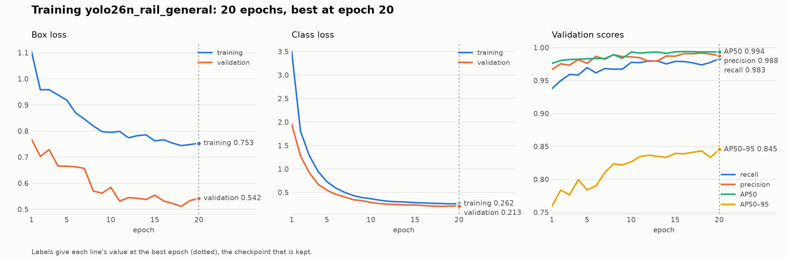
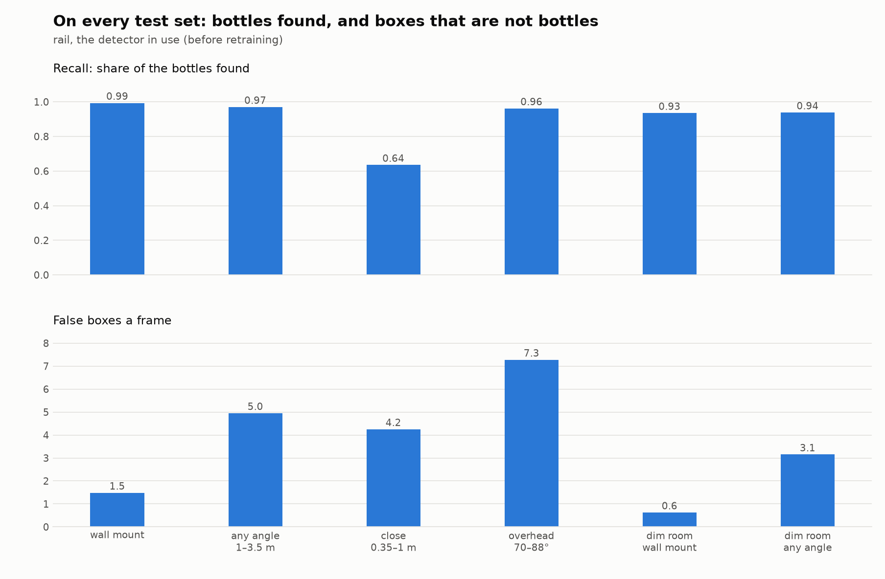
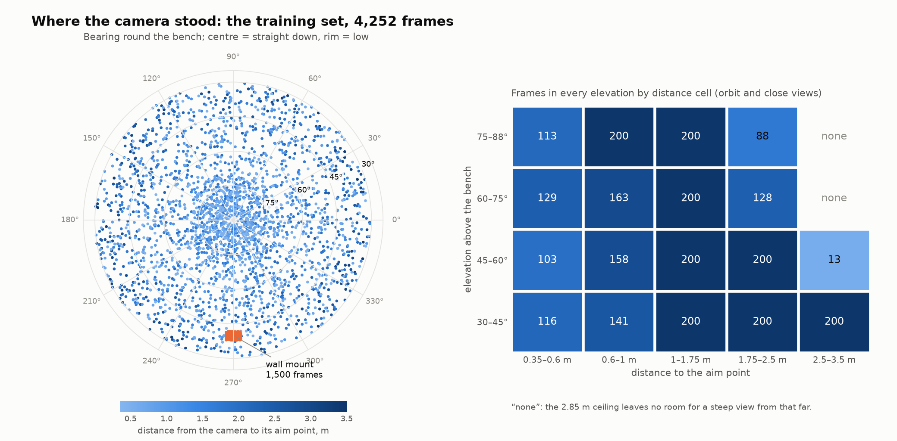

# Training the bench vial detector: data, training, results, and how to repeat it in Isaac Sim

This is the one document about the bench vial detector (YOLO26n, one class,
`amber_bottle`). It covers how the training images are generated in MuJoCo, how
the training set is chosen from them, how the model is trained and scored, what
has been measured so far, what to present at the demo, and how to repeat the
whole thing with frames rendered in Isaac Sim instead. It replaces
`YOLO26_STUDY.md`, `YOLO26_PLAN.md` and `YOLO26_TRAINING_PIPELINE.md`.

Written 2026-09-19. Every number is one of:

- **measured**: from a run that happened, with the script that produced it;
- **decided**: by Martí;
- **estimate** or **proposed**: not run, or not agreed.

**Status in one paragraph.** The images exist: 9,400 rendered frames with exact
labels (measured). The training set is chosen: 4,252 of them (measured). The
detector in use, `rail`, has been scored on every new view, so it is known
where it fails and what retraining has to fix (measured). **The retrained model
does not exist yet: nothing has been trained on the new frames**, and nothing
has been timed on the demo's Mac. Every script the training needs is written
and was run here on what can run without a GPU.

**Where the code is.** The scripts named here that are not on `main` yet
(`select_frames.py`, `pose_map.py`, `training_plots.py`, `train_pod.sh`,
`bench_crop.py`, `viewpoint_study.py`, `limits_sweep.py`, `export_and_time.py`,
`dataset_report.py`, `runs/orbit/train_yolo26_gpu.py`, and the orbit, close,
low, dark and overhead splits of `fixedcam_dataset.py`) are on the branch
`vision/orbit-dataset`, uncommitted in the worktree `../Hackspain-orbit`. The
exact code that rendered the frames is archived in
`docs/presentacion/dataset_viales/pod/codigo_render.tgz`.

## 1. The target (decided)

| | |
| --- | --- |
| Model | **YOLO26n**, fine-tuned from the detector in use, `weights/yolo26n_rail_general.pt` (`rail`). Larger models are dropped: the nano scores 0.99 on the view the robot uses, and what it lacks is data (section 6) |
| Input | **The part of the frame the bench occupies, at the frame's native 1920 px.** That is what the demo runs: the viewer on `main` crops rows 30 to 75 % of the frame at full width (1920 x 486, `view/backend/table_crop.py`) and predicts at native size. Training crops every frame the same way (section 4) and trains at `imgsz 1920`, so the model is trained on what it will see |
| Demo machine | A teammate's Mac with a GPU and 128 GB. `vision_pick.py` already picks `mps` there. Not timed yet (section 8) |
| Training data | MuJoCo renders only. Isaac is the second renderer this document prepares for (section 11) |
| Camera | `general`: GoPro Linear, 1920 x 1080, fovy 60.44 (f = 927 px), on the aisle wall 3 m up, looking down at the bench |
| Objects | amber glass vials, 10 to 100 ml, on the rail scene's 6 x 2 m desk (`minihannover_rail_scene.xml`, UR10e on a 6 m rail); 9 to 36 px tall from the wall mount |
| Classes | one. Identity is the barcode and ring reader's job, not the detector's |
| Latency | 100 ms a frame |
| Light | its variety matters less than elevation and distance: dark frames are tests, not training |

## 2. The pipeline at a glance

```
scene (MJCF, as committed, never written)
  -> per frame, from seed = split.seed + k:
       bottle layout -> arm pose -> light and worktop tint -> camera pose
  -> render RGB + 3 segmentation passes            fixedcam_dataset.py
  -> gt.json: exact box, visible fraction, camera pose of every frame
  -> optional degradation (blur, noise, JPEG, gamma)
  -> check the render                              dataset_report.py
  -> select the training set, even over poses      select_frames.py
  -> draw where the camera stood                   pose_map.py
  -> crop to the bench, YOLO labels                fixedcam_to_yolo.py --crop
  -> fine-tune YOLO26n at 1920 px on a GPU pod     runs/orbit/train_yolo26_gpu.py
  -> score old and new on every test set           viewpoint_study.py --crop
  -> find where each breaks                        limits_sweep.py
  -> figures for the presentation                  training_plots.py
  -> time it on the demo machine                   export_and_time.py
```

`scripts/train_pod.sh` runs select to figures unattended on a pod. Everything
downstream of `gt.json` reads only `gt.json` and the frames, which is what
makes the Isaac route of section 11 a change of renderer and nothing else.

The dataset can be regenerated from its code and seeds alone: the same seeds
give the same frames on any machine. **Never change an existing split's
definition or `EXTRA_PER_SIZE`**: that silently changes what its seeds render.
New data gets new splits with new seeds.

## 3. Generating the frames in MuJoCo

Script: `scripts/fixedcam_dataset.py`. The scene is loaded through
`render_perfumery.Lab`, which adds extra labelled bottles in memory
(`EXTRA_PER_SIZE = 3` of every bottle size of both kits, on top of the scene's
own). Each frame draws the steps below, in this order, from its own seed.

### 3.1 Bottle layout (`lay_out`)

- All movable bottles are parked, then 8 to 34 are stood on free worktop
  (`max_bottles = 34` for the rail splits). A spot is free when a ray cast down
  meets the worktop at the right height and nothing within the bottle's radius.
- 35 % of layouts are a **cluster**: 75 % of the bottles fall within a
  Gaussian of 15 x 12 cm around one point, so they hide each other, as on a
  working bench.
- 10 % of training frames (20 % of test frames) keep the scene's **as-built**
  layout, the one the robot will actually meet.
- Every sample bottle in view is labelled, wherever it stands (bench, shelf,
  room), and tagged with `where`, so the benchmark can score the bench alone
  without the model being taught that a bottle elsewhere is background.

### 3.2 Arm pose (`pose_arm`)

- 75 % of frames: the UR10e reaches a random point 5 to 40 cm above the
  worktop with the rail scene's own IK (`rail_kinematics.reach`), so it leans
  over the bench and hides bottles the way it will when working.
- Otherwise the carriage is parked at a random x along the rail.

### 3.3 Light and materials (`Randomiser.draw`)

| Knob | Training draw |
| --- | --- |
| Light intensity | x U(0.55, 1.45) on every light |
| Light colour | per channel x N(1, 0.035), clipped to 0.9 to 1.1 |
| Headlight | diffuse and ambient each x U(0.55, 1.45) |
| Dark frames | 20 % of wall-mount and 25 % of orbit and close training and validation frames keep only 8 to 50 % of the light |
| Worktop tint | 50 % of frames: the worktop's colour x U(0.78, 1.0), hue within 2 % |

Test splits keep the light nominal, except the dedicated `*_shift` and
`*dark_test` splits. Light is drawn per frame, so varying it adds no frames:
the number of images is set by how well the camera poses are covered, not by
the light (section 7).

### 3.4 The camera: three families of viewpoints

All three render at 1920 x 1080.

**Wall mount (`rail_*`)**: the `general` camera where it is mounted, jittered in
training by N(0, 7 cm) per axis, clipped to 15 cm, and turned by N(0, 2) degrees
about a random axis, clipped to 5 degrees. The shift only goes into the room and
down (measured bug: the mount is flush with the wall and the ceiling, and a
third of the jittered frames of an earlier split put the lens inside them and
came out flat grey with no bottle in view).

**Orbit (`orbit_*`)**: the camera stands anywhere in the room and looks at an
**aim point** on the bench (`Randomiser.orbit`):

1. Aim point: 70 % of the time a bottle standing on the bench, moved in x and
   y by N(0, spread), with spread = `AIM_SPREAD_M` (25 cm) scaled by the
   split's distance range against the orbit's; otherwise a uniform point of
   the worktop. Its height is 0 to 10 cm above the worktop.
2. Direction from the aim point: azimuth U(0, 360) degrees; elevation U(30, 85)
   degrees above the bench plane (below 30 the view grazes the bench); 20 % of
   poses are **overhead**, U(70, 88) degrees (short of 90, where a look-at has
   no up).
3. Distance to the aim point: U(1, 3.5) m.
4. Lens: fovy U(48, 72) degrees around the GoPro's 60.44; roll N(0, 4)
   degrees, clipped to 8.
5. Checks, else redraw (up to 200 tries): the camera is inside the room box
   (`ORBIT_ROOM`, inside the walls, under the ceiling at 2.85 m, short of the
   corridor); nothing blocks the first 85 % of the line of sight to the aim
   point (the last stretch may cross bottles and the arm); and a ray from
   outside to the lens meets nothing, so the lens is not inside a wall, the
   shelf or the arm.
6. Pose: `look_at_quat(position, aim)` then the roll about the line of sight.

The ceiling limits the steep views from afar: with the worktop at 0.90 m and
the ceiling cap at 2.85 m, a camera can rise at most about 1.95 m over its aim
point, so at 2.5 to 3.5 m the elevation cannot pass about 34 to 51 degrees.
Those cells of the grid in section 7 are empty for that reason (measured).

**Close (`close_*`)**: the same sampler at 0.35 to 1 m, so a bottle is 30 to
300 px tall. The aim spread is 7.5 cm here: with the orbit's 25 cm, 2 of the
first 4 preview frames showed no vial, because the frame is only about half a
metre wide this close (measured, then fixed).

Bottle heights in the dataset preview (measured, sampled frames):

| Family | Frames sampled | Boxes | Height p5 / p50 / p95 / max |
| --- | ---: | ---: | --- |
| wall mount | 76 | 1,575 | 14 / 22 / 35 / 39 px |
| orbit | 96 | 1,177 | 13 / 31 / 66 / 129 px |
| close | 56 | 248 | 33 / 78 / 174 / 261 px |

### 3.5 Degradation (`degrade`)

30 % of training frames (100 % of `*_shift` frames) are degraded after
rendering, as a real camera and its encoder would: gamma U(0.8, 1.25) and
contrast U(0.85, 1.1); 70 % a Gaussian blur of sigma U(0.3, 1.2); 80 % sensor
noise of sigma U(1, 6); 80 % JPEG at quality 55 to 95. The parameters drawn are
stored in the frame's record.

### 3.6 Ground truth (`render_perfumery.Lab.render`)

The simulator's state writes the truth and nothing else; the detector only ever
sees the RGB frame. Each frame has three segmentation passes:

- **visible**: every geom except see-through glass (alpha < 0.6), so a bottle
  behind a draft shield still counts as visible. Gives the visible box, `xyxy`;
- **samples only**: the full, unoccluded silhouette of every sample bottle.
  Gives `full_xyxy`, and `visible_frac` = visible pixels / full pixels;
- **category map**: sample, shelf bottle, glassware, balance, instrument,
  other. Used to say what a false box fired on.

A bottle is labelled for training when `visible_frac >= 0.3`
(`fixedcam_crops.MIN_VISIBLE`); the ones hidden further are left out rather
than taught as bottles the model cannot see.

Measured bug: NVIDIA's EGL multisamples the offscreen buffer, so at edges a
segmentation pixel averaged two geoms' id colours and read back as a third geom
or an id past the last one. Segmentation now has its own renderer with
`offsamples = 0`; the boxes are identical to those rendered on Windows.

### 3.7 Splits and seeds

Frame `k` of a split uses seed `split.seed + k`, and every split has its own
range of seeds, so no layout, light or pose is shared between train, val and
test. Tests keep the light nominal and the frames clean unless their name says
otherwise.

| Split | Camera | Frames | Role |
| --- | --- | ---: | --- |
| `rail_train` / `rail_val` | wall mount, jittered | 3,000 / 300 | training (the `rail` model used 1,500 / 150) |
| `rail_test` | wall mount, nominal | 150 | the camera the robot uses; no run may lose here |
| `rail_test_shift` | wall mount, strong light, degraded | 100 | proxy for another renderer or a real GoPro |
| `orbit_train` / `orbit_val` / `orbit_test` | orbit, 1 to 3.5 m | 3,000 / 300 / 300 | any angle over 30 degrees |
| `close_train` / `close_val` / `close_test` | orbit, 0.35 to 1 m | 1,500 / 150 / 150 | near views |
| `dark_test`, `orbit_dark_test` | wall mount / orbit, 8 to 50 % light | 150 each | dim room |
| `overhead_test` | orbit, 70 to 88 degrees | 150 | looking straight down |
| `low_train` / `low_val` / `low_test` | orbit, 15 to 30 degrees, 0.5 to 3.5 m | 600 / 100 / 100 | cameras at bench height; in code, not in the render yet (10.5) |
| `test_open` | wall mount, the open scene (another lab) | 100 | never trained on; not in the render yet |

### 3.8 The render that exists (measured)

Every split of the table except `test_open`: **9,400 frames** (7,500 train,
750 val, 1,150 test), **123,657 labelled vials**. Rendered in 18 min on an RTX
4090 pod in RunPod's EU-RO-1 (32 CPUs, 24 parallel parts, about $0.32; pod
deleted since). Every elevation x bearing cell (6 bands x 12 bearings) holds at
least 35 training frames. Flagged by `dataset_report.py`: 188 frames with no
vial (close views of free worktop, kept as negatives) and 153 with low
contrast (141 dark by design, 12 close views of the white worktop); none with
the camera inside geometry, and no vial lost to the crop.

```bash
export MUJOCO_GL=egl
for i in $(seq 0 23); do
  python computer-vision/scripts/fixedcam_dataset.py --splits rail_train --part $i/24 &
done; wait
python computer-vision/scripts/fixedcam_dataset.py --splits rail_train --merge
```

`--part i/n` renders every n-th frame from the i-th into
`gt.part<i>of<n>.json`; `--merge` joins them into `gt.json`. For scale: 1,900
frames took 2.5 min with 8 processes on an A40, and the laptop's CPU takes
about 2 s a frame. The render was driven by
`docs/presentacion/dataset_viales/pod/pod_run.sh`, which renders every split in
parallel parts, repeats the parts that fail, merges, checks the counts and runs
`dataset_report.py`; the README beside it has the commands.

Where it is: RunPod network volume `hackspain-orbit-dataset` (id
`mwd17cd5k8`, 25 GB, EU-RO-1), frames at `/workspace/fixedcam` (7.4 GB), and
the exact code that rendered them at `/workspace/code`. A training pod created
in EU-RO-1 with that `networkVolumeId` mounts it with no upload. The A40's data
centre (CA-MTL-1) offers no network volumes. Martí validates the frames in a
private artifact (section 7) built from `dataset_report.py`'s output.

## 4. Cropping

**At inference: the bench band (measured).** From the wall mount the bench
always lies between rows 352 and 800 of the 1080. Running `rail` on that
1920 x 448 band alone gives the same accuracy as the whole frame (AP50 0.990,
recall 0.993, 1.2 false boxes a frame at threshold 0.10) in about 0.40x the
time: about 93 ms instead of 233 ms with PyTorch on the laptop's CPU. With
OpenVINO fp16 at a fixed 1920 x 512 input it is 80 ms median (90th percentile
103 ms) with the CPU half busy, against 154 ms for the whole frame
(`scripts/export_and_time.py`). Pass `imgsz=(512, 1920)` to `predict`, or
OpenVINO recompiles on every call and runs about 5x slower. On `main` the
viewer already crops live and replay frames to a fixed band, 30 to 75 % of the
frame's height at full width (`view/backend/table_crop.py`; replay runs `rail`
at 1280 px and 0.47). `labvision/detector.py` does not crop yet, and
`bench_crop.py` (below) computes the band from the camera instead of fixed
fractions.

**At training: every frame cropped to the bench (implemented).**
`scripts/bench_crop.py` projects the worktop box (x -4.5 to 1.5 m, y -1.4 to
0.6 m, from the bench top at z 0.90 m to above the tallest vial at 1.10 m) with
the frame's own camera (`cam_pos`, `cam_xmat`, `fovy_deg` from `gt.json`), pads
it by 8 px and snaps it to multiples of 32 px, the network's stride. From the
wall camera that is a band of about 1920 x 448 to 576 (the jitter moves it); an
orbit frame keeps about 78 % of its pixels on average. `fixedcam_to_yolo.py
--crop` cuts the images and moves the labels, and drops a vial the crop leaves
with under 60 % of its box (`bench_crop.KEEP`). The crop needs only the
camera's pose and field of view, so the same function serves the real camera
from its calibration. What it buys: no training pixels spent on walls and
ceiling, more bottles per mosaic, and the model sees each view as it will run.

Training on 640 px tiles of the crop was considered and dropped: it buys
training time, which at about an hour is not the constraint, and a model
trained on tiles is unproven on the whole band it has to run on.

## 5. Training (written and checked; not run yet)

One run, `n_sel_1920`. Everything not listed is the default of Ultralytics
8.4.155; the run folder's `args.yaml` records every value used, and is saved.

| | |
| --- | --- |
| Script | `runs/orbit/train_yolo26_gpu.py DATA --size n --imgsz 1920 --weights weights/yolo26n_rail_general.pt --name n_sel_1920` |
| Start | `rail`'s weights, not COCO: it already scores 0.99 on the wall mount, and `rail` itself came from `yolo26n.pt` (COCO) |
| Data | `sel_train` and `sel_val` (section 7), every frame cropped to the bench, one class |
| Input | `imgsz 1920`. Ultralytics resizes each image's long side to 1920 and builds square mosaics, so a wall-mount band (1920 wide) keeps its native pixels |
| Epochs | up to 50, `patience 12` (stops 12 epochs after the best) |
| Batch | 8 (fits 24 GB at 1920 px for the nano) |
| Random scale | `scale 0.5`, +-50 %: vial heights span 10 to 250 px. (`rail` used 0.25, when they spanned 9 to 36) |
| Other augmentation, defaults | mosaic 1.0, off for the last 10 epochs; horizontal flip 0.5, no vertical flip; HSV 0.015 / 0.7 / 0.4; translate 0.1; random erasing 0.4; no rotation, shear, perspective, mixup or copy-paste |
| Optimiser, defaults | `optimizer auto`, `lr0 0.01` to `lrf 0.01` linear, momentum 0.937, weight decay 0.0005, 3 warm-up epochs, AMP on, loss gains box 7.5 / cls 0.5 / dfl 1.5 |
| Seed | 0, deterministic |
| Checkpoint kept | `best.pt`, the epoch with the best validation fitness (0.1 x AP50 + 0.9 x AP50-95) |

Time and cost (estimate): 48 s an epoch was measured for 1,500 whole frames at
1920 on an A40 (`runs/rail`); 4,252 frames is about 2.3 min an epoch, 20 to 30
epochs from `rail`'s weights: **45 to 70 minutes, about 1 USD**. The first
epoch on the pod gives the real figure.

**What the run leaves behind** (`train_pod.sh` copies it all to `$OUT`, which
is on the volume and outlives the pod):

| file | what it is | show it? |
| --- | --- | --- |
| `weights/n_sel_1920.pt` | the model | |
| `run/results.csv`, `run/args.yaml` | every epoch's losses and scores; every hyperparameter | |
| `run/results.png`, `BoxPR_curve.png`, `BoxF1_curve.png`, `confusion_matrix.png` | Ultralytics' own plots | backup slides |
| `run/train_batch*.jpg`, `val_batch*_pred.jpg` | mosaics as the model saw them; its boxes on validation frames | yes: the quickest proof it works |
| `plots/pose_map_train.png` | where the camera stood in every training frame (section 7) | **yes** |
| `plots/training_curves.png` | losses and validation scores by epoch, best epoch marked | **yes** |
| `plots/before_after.png` | `rail` against the new model on every test set | **yes** |
| `score_*.md`, `viewpoint/` | the numbers behind it, by elevation, distance and vial size | |

The two figures of `training_plots.py`, drawn here from the one training log
that exists, `rail`'s own (measured: 20 epochs on the 1,500 wall-mount frames,
stopped by hand with validation flat):



## 6. Scoring, and what has been measured

- `scripts/viewpoint_study.py WEIGHTS --crop --pick-on sel_val --splits ...`:
  recall, false boxes a frame and AP50 per test set, broken down by camera
  elevation, distance, vial height in pixels and place in the frame. `--crop`
  predicts on the bench crop, as the model is trained and run. The threshold
  is the best-F1 threshold on the validation set, never on a test.
- `scripts/limits_sweep.py WEIGHTS`: renders the same 12 bench layouts while
  one condition moves, and reports where recall breaks. Its frames are
  rendered once and reused, so a second detector costs only its inference.
- `scripts/fixedcam_bench.py`: the older per-split benchmark, with the worktop
  filter.

### 6.1 The detector in use, on every view (measured)

`rail` at its backend threshold, 0.10, IoU 0.5; test sets of 40 to 80 frames
rendered locally from the same seeds as the full ones on the volume.

| test set | what it shows | vials | recall | false boxes a frame | AP50 |
| --- | --- | ---: | ---: | ---: | ---: |
| `rail_test` | the wall mount, as trained | 1,221 | 0.993 | 1.5 | 0.990 |
| `rail_test`, bench crop | the same, as the viewer runs it | 1,221 | 0.993 | 1.2 | 0.990 |
| `orbit_test` | any bearing, 1 to 3.5 m, 30 to 85 degrees | 794 | 0.970 | 5.0 | 0.964 |
| `overhead_test` | 70 to 88 degrees | 314 | 0.962 | 7.3 | 0.926 |
| `close_test` | any bearing, 0.35 to 1 m | 137 | **0.635** | 4.3 | 0.543 |
| `dark_test` | wall mount, 8 to 50 % of the light | 721 | 0.935 | 0.6 | 0.948 |
| `orbit_dark_test` | any bearing, 8 to 50 % of the light | 387 | 0.938 | 3.2 | 0.942 |

On the as-built bench `rail` boxes 247 of 247 vials. For comparison on
`rail_test`: the earlier fixed-camera model AP50 0.796, the model trained on
Isaac's `lab_dataset_v2` 0.574, YOLO-World L with prompts 0.672.



**The failure is the size of the vial in the picture, not the angle.** `rail`
never saw a vial over 36 px. Over `orbit_test` and `close_test`:

| vial height | vials | recall | fragment boxes per vial |
| --- | ---: | ---: | ---: |
| under 32 px | 365 | 0.98 | 0.1 |
| 32 to 64 px | 407 | 0.97 | 0.3 |
| 64 to 96 px | 102 | 0.91 | 1.8 |
| 96 to 160 px | 49 | 0.22 | 1.4 |
| over 160 px | 8 | 0.00 | 0.0 |

A large vial is missed, or broken into cap, label and body, each boxed as a
small vial (a fragment is a false box at least 70 % inside a vial): 266 of the
396 false boxes on `orbit_test` and 206 of the 291 on `overhead_test`. The
rest are things the wall mount never shows close: cardboard boxes, the brown
drums under the bench, the shelf rack.


### 6.2 How far it goes (measured)

`limits_sweep.py rail`: 12 layouts of 24 vials a level. Light from the wall
mount; distance at 30 degrees of elevation; elevation at 1.5 m.

| light left | 100 % | 50 % | 30 % | 20 % | 15 % | 10 % | 6 % | 3 % |
| --- | ---: | ---: | ---: | ---: | ---: | ---: | ---: | ---: |
| recall | 0.996 | 0.996 | 0.996 | 0.978 | 0.951 | 0.511 | 0.000 | 0.000 |

| distance | 0.25 m | 0.35 m | 0.5 m | 0.75 m | 1 m | 1.5 m | 2.5 m | 3.5 m |
| --- | ---: | ---: | ---: | ---: | ---: | ---: | ---: | ---: |
| median vial height | 160 px | 136 px | 107 px | 82 px | 63 px | 43 px | 29 px | 21 px |
| recall | 0.310 | 0.325 | 0.465 | 0.687 | 0.852 | 0.981 | 0.957 | 0.964 |
| false boxes a frame | 3.1 | 3.8 | 5.6 | 11.8 | 11.1 | 8.4 | 6.0 | 7.6 |

| elevation | 10 | 20 | 30 | 45 | 60 | 75 | 88 degrees |
| --- | ---: | ---: | ---: | ---: | ---: | ---: | ---: |
| recall | 0.885 | 0.939 | 0.981 | 1.000 | 0.992 | 0.972 | 0.945 |
| false boxes a frame | 10.9 | 13.6 | 8.4 | 5.0 | 3.1 | 4.2 | 4.8 |

- Light is a cliff, not a slope: nothing lost to 30 %, half the vials at 10 %,
  all at 6 %, and no false boxes appear in the dark. Not worth training frames.
- Near is the long slope, and the target of the retraining.
- Far is not a limit inside the room.
- Under 30 degrees recall drops 4 to 11 points and false boxes double: the
  reason for the `low_*` splits (section 10.5).

### 6.3 Latency (measured on the i5 laptop only)

Whole `predict` calls, nano, one frame. PyTorch on the idle CPU: 233 ms whole
frame at 1920, about 93 ms on the 1920 x 448 band. OpenVINO fp16 with a fixed
input shape is 3 to 4 times faster with identical boxes (recall 0.975 and AP50
0.977 at 1280 px, both runtimes): 80 ms median on the band, p90 103 ms. A
dynamic shape recompiles every call and runs about 5 times slower. This is the
fallback machine; the Mac is the target and has not been timed (section 8).

### 6.4 When the new model is accepted

1. It does not lose on `rail_test` against `rail` (AP50 0.990, recall 0.993):
   that is the camera the robot uses.
2. It gains on `close_test` (0.543 AP50) and `orbit_test` (0.964), and cuts
   the fragment boxes from above.
3. It runs inside 100 ms on the demo machine.
4. Data check (proposed, 25 minutes): the same run on a third of the training
   set. If the full set wins by more than a point, add frames before variety.

## 7. The training set (measured)

Priorities (decided): many elevations and distances, little weight on light,
and few enough images to train in about an hour. Light, tint and degradation
are drawn per frame and cost no frames; the count is set by how many camera
poses have to be covered. So the set is **selected** from the render, evenly
over poses, by `scripts/select_frames.py`:

- **no dark frames**: they stay in `dark_test` and `orbit_dark_test`;
- **wall mount**: the first 1,500 lit frames of `rail_train` by seed, and the
  first 150 of `rail_val`;
- **orbit and close together**, on a grid of 4 elevation bands by 5 distance
  bands: at most 200 frames a cell, taken round-robin over twelve 30-degree
  bearings, so a capped cell still looks at the bench from all round;
- **validation**: every lit frame of `orbit_val` and `close_val`.

Lit `orbit_train` + `close_train` frames kept / rendered, per cell (measured,
`select_frames.py` on the labels of the 9,400 frames; the same render always
gives the same selection):

| elevation \ distance | 0.35–0.6 m | 0.6–1 m | 1–1.75 m | 1.75–2.5 m | 2.5–3.5 m |
| --- | ---: | ---: | ---: | ---: | ---: |
| 30–45 degrees | 116 / 116 | 141 / 141 | 200 / 283 | 200 / 278 | 200 / 223 |
| 45–60 degrees | 103 / 103 | 158 / 158 | 200 / 310 | 200 / 228 | 13 / 13 |
| 60–75 degrees | 129 / 129 | 163 / 163 | 200 / 354 | 128 / 128 | 0 / 0 |
| 75–88 degrees | 113 / 113 | 200 / 211 | 200 / 387 | 88 / 88 | 0 / 0 |

The empty cells are the ceiling: with the worktop at 0.90 m and the camera
capped at 2.85 m, a view from 2.5 m or more cannot be steeper than about 50
degrees. They do not exist in this room and are not a gap to fill.

| | train | val | test |
| --- | ---: | ---: | --- |
| wall mount | 1,500 | 150 | 150 `rail_test` + 100 `rail_test_shift` |
| orbit + close, the grid | 2,752 | 322 | 300 `orbit_test` + 150 `close_test` + 150 `overhead_test` |
| reported, not decisive | | | 150 `dark_test` + 150 `orbit_dark_test` |
| **total** | **4,252** | **472** | **850 + 300** |

**The pose map.** `scripts/pose_map.py sel_train` draws where the camera stood
in every training frame: the bench from above, overhead views at the centre,
shaded by distance, and the count of every grid cell. It is the figure to show
for "what did the model train on", and the check to run on any training set
before paying for its training: a missing bearing or an empty cell shows at
once. It reads only `gt.json`, so it draws an Isaac dataset the same way.



The interactive version, with every thumbnail, is the review page of the full
9,400 frames: https://claude.ai/artifact/3anS7TBxGczCNA2Rtf1TK8 (private;
offline in `docs/presentacion/dataset_viales/pagina/index.html`).

## 8. State and next steps

### 8.1 Where everything is

| what | where |
| --- | --- |
| Frames (9,400, 7.4 GB) | RunPod network volume `hackspain-orbit-dataset` (`mwd17cd5k8`, 25 GB, EU-RO-1), `/workspace/fixedcam`; the code that rendered them at `/workspace/code` |
| Labels of every frame, locally | `docs/presentacion/dataset_viales/fuentes/etiquetas_gt.tgz` (a `gt.json` per split) |
| Record of the render and how to redo it | `docs/presentacion/dataset_viales/README.md` (Spanish) |
| Code | branch `vision/orbit-dataset`, worktree `../Hackspain-orbit`, **uncommitted**; snapshot of what rendered the frames in `dataset_viales/pod/codigo_render.tgz` |
| Weights in use | `computer-vision/weights/yolo26n_rail_general.pt` (backend `rail`), not in git |
| RunPod access | key in `~/.runpod-render/api_key` on Martí's laptop (never print it); pods `isaac-render-*` are Eloi's |

### 8.2 Next steps, in order

1. Commit the branch's code and bring it to `main`, fetching first: `main`
   moves fast. Until then the pod needs the code uploaded by hand.
2. Time `rail` on the Mac, five minutes, before any training, since the
   architecture is the new model's. With the viewer running, because the
   detector shares the GPU with the MuJoCo render:
   ```bash
   python scripts/export_and_time.py rail --format torch --device mps --band 512
   python scripts/export_and_time.py rail --format coreml --band 512
   ```
   The first is what the viewer does today; the second is the faster path if
   it is not enough. Neither path of the script has run on a Mac yet.
3. Pod with a 24 GB GPU in EU-RO-1 mounting the volume, then:
   ```bash
   R=/workspace/code SRC=/workspace/fixedcam OUT=/workspace/out \
     bash computer-vision/scripts/train_pod.sh
   ```
   It selects, draws the pose map, crops, trains, scores `rail` and the new
   model the same way, and draws the figures; it resumes if the pod drops.
4. Apply section 6.4. Run `limits_sweep.py` on the new weights for the after
   of section 6.2.
5. Register the weights as a backend in `labvision/detector.py` with the
   threshold the score file names, make `labvision` crop with `bench_crop`
   (today only the viewer crops, with fixed fractions), and set the viewer's
   threshold.
6. Delete the pod. Keep the volume until Martí says otherwise (about 1.75 USD
   a month).

Then section 10: bench patterns, lab layouts and low cameras.

### 8.3 Gotchas met on the way

- **Laptop network:** only ports 80 and 443 get out, so no SSH to pods. Drive
  them through a small upload server behind RunPod's HTTPS proxy
  (`https://<pod>-8000.proxy.runpod.net`): PUT a tarball, the boot script
  unpacks it and runs `pod_run.sh`, progress in `/root/out/STAGE`.
- **Pod image:** `runpod/pytorch:2.8.0-py3.11-cuda12.8.1-cudnn-devel-ubuntu22.04`
  boots in about 30 s; a 2.4.0 image hung 16 min. Pin `allowedCudaVersions`
  to 12.8 and 13.0 (driver 570/580).
- **Network volumes** exist in EU-RO-1, not in CA-MTL-1.
- **Windows to pod:** shell scripts checked out on Windows have CRLF endings;
  strip `\r` on the pod. Tar with `--owner=0 --group=0 --numeric-owner`, or
  root's untar fails on uid 197609. Git Bash's `tar` reads `C:` as a remote
  host: pass `--force-local`.
- **Ultralytics** nests `project=runs/x` under `runs/detect/`.
- **OpenVINO** needs a fixed `imgsz` at `predict`, or it recompiles every call.
- **The laptop's CPU** throttles under load (it fell to 20 % in an overnight
  run): run one heavy job at a time, and read timings taken under load as
  ratios.
- **A bug on `main`** since `773c702`: `render_perfumery.Lab(scene=...)`
  ignores `rp.SCENE`, so the `rail_*` splits of `fixedcam_dataset.py` render
  the gantry scene with no arm, and the IK crashes. Fixed on the branch only
  (`load_lab` and `fixedcam_twin.py` pass the scene).

## 9. What we learned

1. **The size of a bottle in the picture limited the current model, not the
   angle.** `rail` holds 0.97 recall at any elevation up to 75 degrees but
   breaks bottles taller than about 96 px into parts, because it never saw one
   over 36 px. Near views fix that; more bearings alone would not have.
2. **The look of the lab moves the scores more than the camera does.** With
   the camera fixed, a new scene cost 0.19 AP50, and between MuJoCo and Isaac
   the models nearly stopped working. Angles are covered now; appearance is not
   (section 10).
3. **The image count follows the coverage of camera poses.** Light, tint and
   degradation are drawn per frame and cost nothing. 1,500 frames were enough
   for one view, so the grid needs a few hundred frames a cell at most.
4. **The room shapes the grid.** The ceiling rules out steep views from far
   away. Cap the cells; do not try to fill them.
5. **Cropping to the bench is free accuracy-wise and 2.5x faster at
   inference.** At training it only saves time together with tiling at a
   smaller `imgsz`.
6. **The threshold belongs to the view.** 0.47 for the wall mount, 0.62 for
   orbit views: always pick it on validation frames of the views that will be
   run.
7. **The detector is not the scan's bottleneck.** It boxes 247 of 247 vials on
   the as-built bench. The fixed camera does miss 3 at the aisle edge, and the
   wrist camera reads those. The two-camera design (the fixed camera proposes,
   the wrist camera confirms) is what absorbs a detector's misses and false
   boxes.
8. **Check the renders, not only the numbers.** Every rendering bug was found
   by looking at frames: grey frames from a lens inside the wall, wrong
   segmentation ids from multisampling, the wrong scene loaded silently, empty
   close views from too wide an aim spread.
9. **Isaac Sim** (details in 11.1): layouts that never move leak between
   splits; boxes come per mesh part; unlabelled bottles become negatives; pose
   edits must go through Fabric; camera axes differ between APIs; prim paths
   say `SMP_0001`, not `SMP-0001`.

## 10. Edge cases, and how the robot adapts to a new lab

The render covers where the camera stands very widely, but only in one lab:
every frame is the rail scene, with the same room, bench, objects and amber
vials. Camera placement is what changes most visibly from one lab to another,
but it is not the only thing that changes, and it is not the one that has cost
the most so far. With the camera held fixed, moving from the gantry scene to
the open scene dropped the fine-tuned nano from AP50 0.864 to 0.675
(`docs/FIXED_CAMERA_BENCHMARK.md`).

### 10.1 What can change, and what the dataset covers

| Case | Covered by the render? | What is known |
| --- | --- | --- |
| Camera at another bearing or height, 30 to 88 degrees above the bench | yes | `rail` already holds 0.97 recall on `orbit_test` |
| Camera below 30 degrees (eye height, across the bench) | not yet: `low_*` splits in code, unrendered (10.5) | `rail` recall 0.94 at 20 degrees and 0.89 at 10, with 11 to 14 false boxes a frame |
| Camera much nearer, so bottles are large (60 to 300 px) | yes, `close_*` | `rail` fell to 0.22 recall at 96 to 160 px and 0 above 160 px |
| Looking straight down | yes, overhead poses + `overhead_test` | `rail` recall 0.96, but 7.3 false boxes a frame, most of them fragments of vials |
| Bottles in the frame's corners | partly | `rail` recall 0.83 there |
| Another lens: wide or fisheye, distortion, other resolution | fovy 48 to 72 only, no distortion, always 1920 x 1080 | undistort from calibration first |
| Another room: walls, floor, bench material, clutter | no (worktop tint only) | a new scene cost 0.19 AP50 with the camera fixed |
| Look-alike objects: brown boxes, drums, amber reagent bottles | only what the scene holds | 1.6 false boxes a frame on boxes, drums and the shelf rack from orbit views |
| Other containers: clear glass, white HDPE, vials in racks, other caps | no, amber vials only | the model will miss them or box them unpredictably |
| Dense packing and occlusion by the arm | yes: 35 % clusters, arm in every frame | a bottle under 30 % visible is not labelled, so it will not be found either |
| Dim room | rendered, left out of the training set on purpose | `rail` holds to 15 % of the light (0.95 recall), falls to 0.51 at 10 % and finds nothing at 6 %, without inventing boxes |
| Windows, backlight, glare and reflections on glass | no | never rendered |
| Real sensor: noise, blur, JPEG, exposure | 30 % of training frames degraded | a degraded camera cost the earlier nano 0.10 AP50 |
| Motion blur | no | |
| Simulation to reality: real glass, real textures | no | the largest unknown: no real photograph has been scored yet |
| Operating threshold | set per view on validation | 0.47 on the wall mount, 0.62 on orbit views |
| Latency on the lab's computer | 100 ms only with the nano, the crop and OpenVINO on a CPU | a GPU takes any size in a few ms |

### 10.2 How the robot adapts to a new lab (proposed)

1. **Calibrate the fixed camera** (intrinsics and pose relative to the bench).
   It gives the bench crop, the pixel-to-bench mapping, and whether the lens
   needs undistorting.
2. **Photograph the bench 20 to 50 times** with vials placed at random.
   Label them: pseudo-label with YOLO-World and correct by hand, as was done
   for Isaac's unlabelled vials. Score the model on them and set the threshold
   there.
3. **Fine-tune if recall is short**, on those photographs mixed with the
   simulated frames: minutes on a rented GPU.
4. **Lean on the two cameras.** The fixed camera proposes and the wrist camera
   confirms by reading the label. A false box costs one look, not a wrong
   pick. The wrist camera also finds vials the fixed camera misses, which is
   how the scan reaches 19 of 19.
5. **For a lab that is different in kind**, build its twin (MuJoCo or Isaac)
   and run this pipeline on it.

### 10.3 Lab randomisation, a possible second phase (proposed)

No new lab has to be modelled: the rail scene already holds enough to rearrange
into many. Measured inventory of `minihannover_rail_scene.xml`:

- 7 instruments as bodies of their own (the sink, 5 balances, the GC-MS and
  the UV-Vis-NIR), so they can be moved without editing the XML;
- the rest of the room as one static body of 1,409 geoms: chairs, cartons,
  drums, racks, office desks, people, fume extraction arms, the drying rack;
  grouped by object, they can be moved or hidden per frame through the model's
  geom poses;
- 213 textures, 398 materials and 11 lights.

Per frame, keeping the bench, the rail and the arm where they are (the robot's
workspace):

1. **appearance**, the cheapest and the one aimed at the gap measured in
   section 9: textures and colours of walls, floor, worktop and furniture from
   the existing textures, lights moved, dimmed or switched off;
2. **arrangement**: instruments and furniture moved, removed or repeated, plus
   look-alike distractors (brown boxes, clear bottles, amber reagent bottles)
   as negatives;
3. **scenes**: train on the gantry and rail scenes and keep the open scene out
   as the unseen lab.

Randomising the lab in the same frames as the camera costs no extra frames;
a separate `lab_*` set of 3,000 / 300 / 300 was the other option. Measure it
on `test_open` and on held-out seeds. Swapping textures at run time has to be
checked on about 20 frames first. Estimated effort: half a day to a day of
work, minutes of rendering.

Other ways to improve the model, by expected gain for cost: hard negatives
(run `rail` over the training frames and repeat the ones where it fires on
boxes, drums or shelving); a threshold per view; OpenVINO for headroom within 100 ms (80 ms measured on the
crop), which could make room for a larger input or `s`; confirming a vial over
2 or 3 frames of the still fixed camera (`vision_pick` already tracks
detections); Isaac frames and real photographs for the step to reality.

### 10.4 The bench patterns the demo already shows (proposed, first in line)

`simulation/scripts/bottle_patterns.py` (Nacho, `f3a0f46`) draws a whole
worktop from one integer: 10 to 75 flasks, spacing 4 to 60 mm, scattered,
clustered, in rack-like rows or crowded into one stretch, from five flask
sizes. Ten are catalogued, `p01` (16 flasks, spread) to `p10` (71 in rows), and
since `f0f2505` the viewer builds the rail scene with one of the ten, at
random, on every page load (`view/backend/scene_patterns.py`). **The demo
already shows benches the detector was never trained on**: the dataset's
`lay_out` stands 8 to 34 vials, scattered or in one cluster, never in rows.

Measure first (minutes): `pattern_test`, the ten catalogued patterns, each
from the wall mount, 10 orbit poses and 5 close poses, 160 frames; score `rail`
and the retrained model by pattern style and spacing. Only if rows at 4 mm
score worse than the rest, render `pattern_train` (1,500 frames from seeds
that exclude the catalogued ten: 500 wall mount, 700 orbit, 300 close) and
`pattern_val` (150), and keep `pattern_test` as the demo's own benches.

How: either load the pattern's model as the viewer does and teach
`render_perfumery.Lab` to find its flasks, or give `lay_out` a mode that takes
positions and sizes from `bottle_patterns` and stands `Lab`'s own vials there.
75 flasks need more than today's 34 movable vials, and raising
`EXTRA_PER_SIZE` changes every existing frame, so it must be a per-split
setting, checked by rendering the first 16 frames of `rail_train` and
comparing them with the volume's.

The lab layouts of 10.3 are drawn in the same frames, so they cost no extra
frames: a `pattern_train` frame has its own bench, its own room and its own
camera. Every draw goes into the frame's `randomisation`, as the camera pose
does today, so scoring and the pose map can group by it.

### 10.5 Low cameras (in code, not rendered)

`low_train` / `low_val` / `low_test`: 15 to 30 degrees above the bench, 0.5 to
3.5 m, 600 / 100 / 100 frames, from seeds of their own. Measured need: `rail`
loses 4 to 11 points of recall there and draws 11 to 14 false boxes a frame
(section 6.2).

### 10.6 The second render and run (estimate)

About 2,900 frames (`pattern_*` 1,810, `low_*` 800, `lab_test` 150,
`test_open` 100). At the measured 9,400 frames in 17 minutes: about 6 minutes,
under 0.20 USD. Training set 4,252 + 2,100, fine-tuned from the first model:
about 1.5 hours, 1.50 USD. The review page then gains a bench-style and a
lab-variant filter on the pose map, a coverage grid of bench style by camera
family, and histograms of vials a frame and tightest spacing; `pose_map.py`
gains the same grouping.

## 11. Replicating it in Isaac Sim

### 11.1 What Isaac already has, and what went wrong before

- The Isaac scene is the MuJoCo scene exported to USD:
  `simulation/scripts/export_usd.py` (MuJoCo's own USD exporter, no Isaac
  needed) writes `lab_usd/`, with every name sanitised to `[A-Za-z0-9_]`, so
  `SMP-0001` becomes `SMP_0001` in prim paths. Eloi's
  `simulation/scripts/dataset_gen_v3.py` renders it with Replicator's
  `BasicWriter`. Setup: `simulation/runpod-isaac.md` (official image
  `nvcr.io/nvidia/isaac-sim:4.5.0`, the `dockerEntrypoint` override, about
  4.5 min to first boot, no RTX 5090, driver 570/580).
- `lab_dataset_v1` and `v2` never moved the bottles (only light and a small
  camera jitter changed). A random frame split then leaks, and a model learns
  positions. `v3` reshuffles every bottle each state.
- Isaac boxed every mesh of a bottle separately (body, cap, label): 133,400
  boxes were 48,100 bottles. `isaac_dataset_to_yolo.py` merges them by union
  per (image, sample id).
- About 220 `stock_reserve` vials had no semantic label, so no box: positives
  taught as background. They were pseudo-labelled with YOLO-World as a stopgap.
- `v3` found that raw USD `xformOp` edits between renders do not reach the
  render (Fabric caches transforms), while light attribute edits do. Poses go
  through `isaacsim.core.prims.XFormPrim.set_world_poses` followed by
  `app.update()` before the render.
- Moving the cameras through Fabric flipped the `general` view in `v3`, so v3
  kept the cameras at their base poses. A likely cause is an axis convention:
  USD and MuJoCo cameras both look down -Z with +Y up, while Isaac's `Camera`
  helper defaults to a "world" convention (+X forward, +Z up). Check which one
  the call assumes.
- The model trained on Isaac's `v2` scored AP50 0.780 on its held-out camera
  but 0.574 on MuJoCo's `rail_test`, and MuJoCo-trained models found almost
  nothing on Isaac frames: the renderer gap is large in both directions.
- The MuJoCo twin camera did not overlay Isaac's `general` view exactly
  (fovy 36.28 in the twin), so intrinsics must be checked, not assumed.

### 11.2 Recommended approach: MuJoCo plans every frame, Isaac renders it (proposed)

Rather than re-implement the layout sampler, the IK, the ray checks and the
camera sampler in Isaac, let `fixedcam_dataset.py` draw each frame exactly as
it does now and write the resulting state; an Isaac script then only applies
that state and renders. Both simulators then show the same frame, which gives:

- the same distributions of layouts, arm poses, angles and distances, with no
  second implementation to keep in step;
- paired frames, so the renderer gap is measured frame by frame, and a
  MuJoCo + Isaac mix differs only in appearance;
- a check of Isaac's truth: its boxes should match MuJoCo's boxes of the same
  frame.

Steps:

1. **Export the rail scene.** `python simulation/scripts/export_usd.py
   simulation/models/minihannover_rail_scene.xml OUT` with the extra bottles of
   `EXTRA_PER_SIZE` included (they are added in memory by `render_perfumery`,
   so the export must go through the same `Lab` object, not the XML alone).
   Render at 1920 x 1080, not the 1600 x 900 of v1 to v3, so the crop and the
   pixel sizes match the GoPro.
2. **Dump the state per frame.** Add a `--dump-state` flag to
   `fixedcam_dataset.py` that writes, next to `gt.json`, for each frame: the
   world pose (position and quaternion) of every geom that is not where the
   export put it (bottles, parked bottles, arm links, carriage), the camera's
   `cam_xpos`, `cam_xmat` and fovy, and the light and tint draws. `gt.json`
   already stores the camera and the randomisation; the geom poses are what is
   missing. Geom poses rather than joint angles, because the exporter writes one
   prim per geom and Isaac then needs no IK and no articulation.
3. **Apply it in Isaac**, per frame:
   - geoms: `XFormPrim(paths).set_world_poses(positions, orientations)`, then
     `app.update()` (the path v3 proved);
   - camera: one Replicator camera per render product, its world pose set from
     `cam_xpos` and `cam_xmat` (the two simulators share the -Z forward, +Y up
     convention). Isaac uses square pixels and ignores the USD vertical
     aperture, so set `focalLength = f_px * horizontalAperture / 1920` with
     `f_px = 540 / tan(fovy / 2)`: 10.12 mm for fovy 60.44 with the default
     20.955 mm aperture;
   - lights: intensity and colour attribute edits, the recorded scale on top of
     the base multiplier (`render_usd.py` uses `LIGHTMUL = 40` because the
     exporter's lights are far too dim for RTX; v3 drew 28 to 52);
   - worktop tint: the worktop material's diffuse colour input;
   - render with `rep.orchestrator.step(rt_subframes=...)` of 4 or more, so the
     real-time renderer does not ghost after every bottle teleports.
4. **Degrade after rendering** with the same `degrade()` and the parameters
   recorded for that frame in `gt.json`, so the degraded frames match too.
5. **Truth.** `BasicWriter` with `rgb`, `bounding_box_2d_tight` (visible box
   and `occlusionRatio`), `bounding_box_2d_loose` (full box), `camera_params`
   and `instance_id_segmentation`. Label every sample bottle, including the
   `stock_reserve` ones: every mesh of a bottle gets the class of its sample
   id. Then `scripts/isaac_replicator_to_gt.py` writes the same `gt.json`,
   camera fields (`cam_pos`, `cam_xmat`, `fovy_deg`) included, so
   `fixedcam_to_yolo.py --crop` and everything else downstream run unchanged.
   Two fixes the converter needs first:
   - its sample-id pattern is `(SMP|PWD)-\d{4}` but the exported prims say
     `SMP_0001`: accept `[-_]` and normalise to the hyphen;
   - it pairs boxes per prim, so it keeps one box per mesh part: merge the
     parts by union per (frame, sample id), as `isaac_dataset_to_yolo.py` does,
     and combine their visible fractions weighted by pixels.
6. **Acceptance test before rendering at scale**, on 50 frames: for each
   bottle, the IoU between Isaac's box and MuJoCo's box of the same frame. A
   median under about 0.8, or boxes offset all one way, means a camera pose,
   axis or focal length error. Look at a contact sheet with both boxes drawn.
   Also check see-through glass: MuJoCo's truth does not let glass hide a
   bottle; if Isaac's occlusion ratio does, bottles behind a draft shield will
   fall under the 30 % visibility floor and turn into unlabelled positives.

For the reduced plan of section 7, replay only the selected frames: about
4,252 training and 472 validation frames, plus the test splits.

### 11.3 If the Isaac scene stops being the MuJoCo export

If Eloi's scene diverges (other assets, other layout), the samplers have to be
re-implemented in Isaac. The numbers to copy:

| Step | MuJoCo (`fixedcam_dataset.py`) | Isaac |
| --- | --- | --- |
| Bottle layout | 8 to 34 bottles on free worktop, 35 % clusters (15 x 12 cm), 10 % as-built | a Python sampler as in v3's `reshuffle`, poses through `XFormPrim` |
| Arm | 75 % IK reach 5 to 40 cm above the worktop, else parked | joint targets from `rail_kinematics.reach` run offline, or recorded MuJoCo poses |
| Light | x0.55 to 1.45, colour 3.5 % | `UsdLux` intensity and colour edits |
| Worktop | 50 % tinted x0.78 to 1.0 | material diffuse colour |
| Wall mount | +-15 cm into the room and down, +-5 degrees | camera pose per frame |
| Orbit | aim point 70 % at a bottle +-25 cm; azimuth 0 to 360; elevation 30 to 85 (20 % at 70 to 88); 1 to 3.5 m; fovy 48 to 72; roll +-8 | same numbers, pose per frame; cover the grid of 7.1 |
| Close | the same at 0.35 to 1 m, aim spread 7.5 cm | same |
| Line of sight | MuJoCo ray casts | PhysX scene queries need colliders, which the export may lack; alternatively render `distance_to_camera` and reject a frame whose aim pixel is nearer than 85 % of the range or whose image is nearly flat |
| Degradation | `degrade()` after rendering | the same function |
| Truth | segmentation passes, `visible_frac` | tight and loose boxes, `occlusionRatio` |

Whatever the route, never split a static layout by random frames, and hold out
seeds (or whole cameras) for validation and test, as in section 3.7.

### 11.4 The experiments to run on Isaac frames (proposed)

1. Render `isaac_rail_test` (the `rail_test` seeds) and `isaac_orbit_test`, and
   score today's `rail` on them. This measures the gap with no training.
2. Fine-tune the MuJoCo-trained model on Isaac's training frames alone.
3. Fine-tune on a MuJoCo + Isaac mix, half and half to start.
4. Score all three on the MuJoCo and the Isaac test sets with
   `viewpoint_study.py`, threshold picked on the mixed validation set. Keep a
   model only if it does not lose on MuJoCo's `rail_test` and gains on Isaac's.

A handful of real photographs of the bench, labelled by hand, would be worth
more than any of these: they are the only test of the step to the real camera.

### 11.5 Time and cost

| Step | Where | Time | Cost |
| --- | --- | --- | --- |
| MuJoCo render, 9,400 frames | RTX 4090, EU-RO-1, 24 parts | 18 min (measured) | about $0.32 |
| Isaac pod start | A5000 or A40 | about 6 min image pull + 4.5 min first boot (measured) | about $0.10 |
| Isaac render | A40 | unknown: measure on the first 50 frames | |
| Training, nano, 1,500 frames | A40 | 48 s an epoch (measured) | |
| Training, nano, the selected set | RTX 4090 or A40 | 45 to 70 min at 1920 (estimate) | about $1 |

### 11.6 Selecting, training and presenting on Isaac frames

Once `isaac_replicator_to_gt.py` writes `gt.json` with the camera fields and,
for replayed frames, the MuJoCo frame's `randomisation` copied across, nothing
downstream knows which renderer made the frames:

```bash
python scripts/select_frames.py --src ISAAC_DIR           # the same 4,252 frames
python scripts/pose_map.py sel_train --src ISAAC_DIR --out pose_map_isaac.png
R=... SRC=ISAAC_DIR OUT=... bash scripts/train_pod.sh n_sel_1920_isaac
```

- `select_frames.py` needs `randomisation.orbit` (elevation, bearing,
  distance) and `randomisation.dark` in each frame's record. If frames are
  replayed from MuJoCo's state (11.2) they are the same records. If Isaac draws
  its own poses (11.3), write those three numbers per frame.
- `bench_crop` needs `cam_pos`, `cam_xmat` and `fovy_deg`, in MuJoCo's camera
  convention (looking down -Z, +Y up).
- Train with exactly section 5's settings, from the same `rail` weights, so
  the only difference between the two models is the renderer. For the mix of
  11.4, point `fixedcam_to_yolo.py` at both folders' `sel_train`.
- `train_pod.sh` scores on whatever test splits `SRC` holds; pass
  `TESTS=isaac_rail_test,isaac_orbit_test` to score on Isaac's and run it again
  with MuJoCo's `SRC` for the cross-renderer numbers.
- `training_plots.py` and `pose_map.py` give the same three figures for the
  Isaac run, so the presentation can put the two renderers side by side.

## 12. What to present at the demo

Figures (all regenerated by `train_pod.sh`; the first exists now):

1. **The pose map** (section 7): 4,252 training images, every one from its own
   camera pose, all round the bench and from 30 degrees to straight down.
2. **Training curves**: losses falling, validation scores rising, the epoch
   kept.
3. **Before and after** on every test set: the near views are the headline,
   0.64 recall today.
4. `val_batch*_pred.jpg`: the model's boxes on frames it never trained on.
5. The review page, live, for anyone who asks what the data looks like.

Live, in the viewer, what the measurements say will work and what will not:

| show | today, with `rail` | expected after retraining |
| --- | --- | --- |
| Walk a camera round the bench | works, 0.97 recall | works |
| Bring it close, under 1 m | breaks: 0.64, vials cut into pieces | the clearest before and after |
| Look straight down | finds them, 7 false boxes a frame | fewer false boxes |
| Turn the lights down | holds to 15 % of the light, goes quiet below 10 % | the same: not trained for |
| A cardboard box or a beaker by the vials | sometimes boxed from close | not boxed |
| Reload the page for another bench pattern | never measured | measure with `pattern_test` first (10.4) |
| A camera at bench height | 0.89 to 0.94, many false boxes | needs the `low_*` render (10.5) |

Not covered by anything here: other containers (clear glass, HDPE), a hand in
the frame, windows and glare, and real photographs. The step from simulation
to a real camera is the largest unknown, and no real photograph has been
scored.

## 13. Files

| File | What it does |
| --- | --- |
| `scripts/fixedcam_dataset.py` | renders the splits: layout, arm, light, camera, degradation, truth |
| `scripts/render_perfumery.py` | `Lab`: scene, extra bottles, segmentation truth |
| `simulation/scripts/rail_kinematics.py` | the arm's IK used to pose it |
| `scripts/dataset_report.py` | statistics, flags and thumbnails of a render, for its review page |
| `scripts/select_frames.py` | the training set: no dark frames, capped evenly over camera poses |
| `scripts/pose_map.py` | the figure of where the camera stood in every frame of a set |
| `scripts/bench_crop.py` | the part of a frame the bench occupies, from the camera's pose and field of view |
| `scripts/fixedcam_to_yolo.py` | `gt.json` to a YOLO dataset, one class, `--crop` to the bench |
| `runs/orbit/train_yolo26_gpu.py` | the training run (`--weights` to fine-tune) |
| `runs/rail/train_yolo26n_gpu.py` | how `rail` was trained |
| `scripts/train_pod.sh` | select, crop, train, score and draw, unattended on a pod |
| `scripts/viewpoint_study.py` | scores by elevation, distance, vial size and place in the frame; `--crop` as the model runs |
| `scripts/limits_sweep.py` | where a detector breaks as light, distance or elevation moves |
| `scripts/training_plots.py` | training curves and before/after figures from the run's files |
| `scripts/export_and_time.py` | exports to CoreML or OpenVINO, or keeps PyTorch, and times whole `predict` calls on this machine |
| `scripts/fixedcam_bench.py` | the older benchmark by split |
| `scripts/isaac_replicator_to_gt.py` | Replicator `BasicWriter` output to the same `gt.json` |
| `scripts/isaac_dataset_to_yolo.py` | Isaac COCO datasets (v1 to v3) to YOLO, merging mesh parts |
| `simulation/scripts/export_usd.py` | MuJoCo scene to USD for Isaac |
| `simulation/scripts/dataset_gen_v3.py` | Isaac Replicator generator with per-state reshuffle |
| `simulation/scripts/bottle_patterns.py`, `view/backend/scene_patterns.py` | the seeded bench patterns, and how the viewer loads them |
